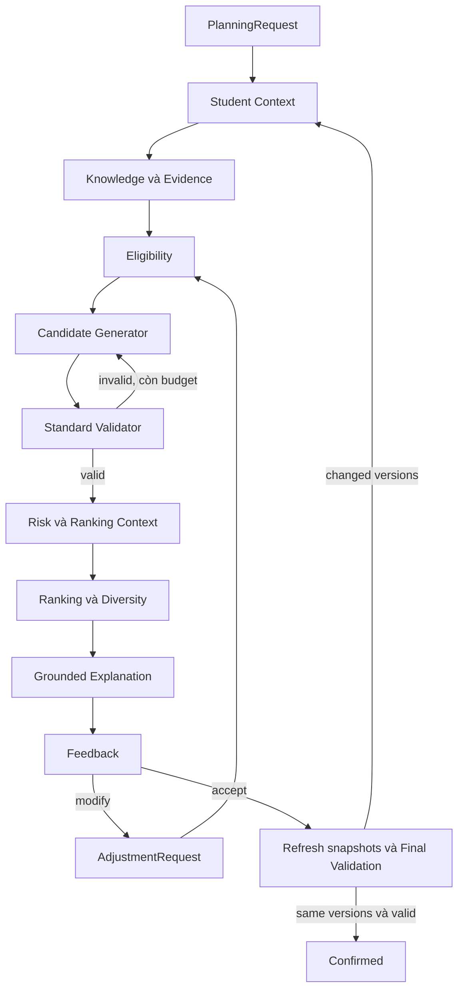

# Đặc tả triển khai Agent MVP: capability, contract và Ranking

Phiên bản thiết kế: `mvp-contracts-v2-pdf3`, cập nhật trạng thái source ngày 2026-09-16. Tài liệu bổ sung cho [thiết kế tổng thể](THIET_KE_AI_AGENT.md), [nghiệp vụ](BA_AI_AGENT.md), [công nghệ](CONG_NGHE_VA_TOOLS.md) và [lộ trình](LO_TRINH_MVP.md); không sửa bản PDF nguồn. AgentPipeline, typed capability adapters, Validator, Feedback/Re-planning và Final Validation/Confirm hiện đã được triển khai; các đoạn dùng “dự kiến” giữ vai trò contract/thiết kế lịch sử hoặc hạng mục còn thiếu, không phải phủ nhận source hiện hành.

**Tất cả trọng số, ngưỡng risk/diversity và ngân sách dưới đây là đề xuất khởi tạo chưa được hiệu chỉnh hoặc kiểm chứng thực nghiệm.** Chúng phải có phiên bản, được đánh giá trên validation theo sinh viên và đóng băng trước test. `StandardValidator` là kiểm tra học vụ; tập validation là dữ liệu hiệu chỉnh, hai khái niệm khác nhau.

## 1. Phạm vi và quyết định kiến trúc

MVP hoàn thành Student Profile → Agent → Ontology → tối đa ba valid plans → Explanation → Feedback → Re-planning. Chưa huấn luyện LTR; lưu lựa chọn/chỉnh sửa để phục vụ giai đoạn sau. Capability là giao diện nghiệp vụ Python có kiểu dữ liệu; chưa bắt buộc là HTTP, MCP hay LLM function calling. Một capability có thể bọc nhiều truy vấn/hàm nội bộ. Adapter cho LangGraph/LLM, nếu có, chỉ gọi cùng contract.

Orchestrator là thành phần duy nhất cập nhật Agent State. Tool nhận phần dữ liệu cần thiết, không nhận đối tượng State có thể sửa. Tool thuần trả kết quả; ghi feedback là side effect tường minh, có khóa chống ghi trùng. Re-planning là một nhánh điều phối gọi lại các tool, không là generator thứ hai.



Các nhánh thiếu dữ liệu/lỗi trả trạng thái có cấu trúc và dừng nhánh phụ thuộc. Diagram rút gọn không thể hiện mọi nhánh lỗi. Risk chạy sau Validator nhưng trước Ranking. Chỉ gộp candidate trùng chính xác trước Validation; điều kiện diversity áp dụng sau Validation, không loại sớm phương án khác nhau chỉ vì gần giống.

## 2. Mapping capability → tool → module

Xem [sơ đồ mapping trực quan](MAPPING_CAPABILITY_MODULE_TOOL.md), phân biệt module đã có, phần cần tách context và tool/adapter dự kiến.

Tên tool và các đường dẫn ghi **mới** là đích triển khai, chưa tồn tại. Module có sẵn là điểm tái sử dụng, không mặc nhiên đáp ứng contract mới. Đường dẫn tính từ gốc repository.

| Capability | Tool Python dự kiến | Module adapter mới | Phần có sẵn / việc cần làm |
|---|---|---|---|
| Student Context | `load_student_context` | `backend/app/capabilities/student_context.py` | Bọc `services/student_data_service.py`; tạo snapshot tại học kỳ đích, không dùng lịch sử tương lai |
| Ontology/Knowledge | `load_knowledge_context` | `backend/app/capabilities/knowledge.py` | Bọc `services/ontology_evidence_service.py` và `knowledge/queries/*.rq`; thêm loader manifest CTĐT/rule/offering và chứng minh tính đầy đủ |
| Eligibility | `build_course_space` | `backend/app/capabilities/eligibility.py` | Tái sử dụng có kiểm tra `services/recommendation/eligibility.py`; bỏ phụ thuộc học kỳ hiện tại/live engine; thêm evidence cho từng quyết định |
| Generation | `generate_candidates` | `backend/app/capabilities/generation.py` | Bọc Beam Search trong `services/recommendation/candidate_generation.py`; input snapshot tường minh, seed và thứ tự ổn định |
| Validation | `validate_candidate` | `backend/app/capabilities/validation.py` | Bọc `validation/validator.py::StandardValidator.validate`; giữ độc lập với Agent/Flask/LLM |
| Risk | `assess_plan_risk` | `backend/app/capabilities/risk.py` | MVP dùng proxy tại mục 6; `services/recommendation/plan_risk.py` là thuật toán cũ, không tự coi heuristic theo tên môn là ontology fact |
| Ranking | `rank_valid_plans` | `backend/app/capabilities/ranking.py` | **Mới**: `services/plan_ranking_service.py`, `schemas/ranking.py`; không lấy điểm heuristic cấp môn làm điểm kế hoạch |
| Explanation | `explain_plans` | `backend/app/capabilities/explanation.py` | Đã triển khai `services/grounded_explanation_service.py`; bộ `explanation_generator.py` cũ chỉ tham khảo cách trình bày |
| Feedback | `normalize_feedback`, `persist_feedback` | `backend/app/capabilities/feedback.py`, `services/agent_run_store.py` | Đã kiểm tra schema/hash/run ID, tạo `AdjustmentRequest`, lưu JSON idempotent theo `(run_id, feedback_id)`, giữ provenance và hash |
| Re-planning / Confirm | `replan_from_feedback`, `confirm_from_feedback`, `confirm_plan` | `backend/app/agent/pipeline.py`, `backend/app/capabilities/confirmation.py` | Đã chạy lại Generation → Validator → Risk → Ranking → Explanation; Confirm tải lại snapshot hiện hành, version đổi thì tạo vòng mới và yêu cầu chọn lại |

Đã có `schemas/capability.py` cho envelope, lỗi/provenance và `schemas/agent_state.py` cho State; `agent/orchestrator.py` hiện kiểm tra chuyển trạng thái và validation gate. Feedback normalization, `AdjustmentRequest`, Re-planning, Final Validation và API lưu/đọc run đã có trong pipeline. Logic học vụ nằm dưới `services/` hoặc `validation/`, không import ngược `agent/` hay Flask routes.

## 3. Contract chung và schema tối thiểu

Các schema hiện có được giữ tên: `PlanningRequest`, `StudentSnapshot`, `KnowledgeVersion`, `KnowledgeSnapshot`, `CandidatePlan`, `ValidationResult`, `EvidenceRecord`, `OntologyFactEvidence`. Các schema mới dưới đây là đặc tả trường để triển khai Pydantic; collection bất biến, cấm field lạ, mã môn chuẩn hóa và timestamp có timezone như `SchemaModel` hiện có.

| Schema mới | Trường bắt buộc và ý nghĩa |
|---|---|
| `ToolCallContext` | `run_id`, `call_id`, `iteration` (>=0), `contract_version`, `deadline_at`, `attempt` (>=1), `input_hash`; `idempotency_key` bắt buộc với persist |
| `ToolResult[T]` | `status: ok/error`, `output: T/null`, `error: ToolError/null`, `provenance: Provenance`; đúng một trong output/error có giá trị |
| `ToolError` | `code`, `message`, `retryable`, `field_paths[]`, `course_codes[]`, `evidence_ids[]`; không trả traceback/secret ra API |
| `Provenance` | `call_id`, `tool_name`, `tool_version`, `code_commit`, `input_hash`, `output_hash`, `source_refs[]` có content hash, `knowledge_versions` (null chỉ trước khi đủ snapshot), `config_hash`, `evidence_ids[]`, `started_at`, `finished_at` |
| `StudentContextOutput` | `student_snapshot`, `source_manifest_ref`, `target_term_id`, `history_cutoff`, `normalization_rule_version`; mọi ánh xạ thang GPA, mã môn, ngành, miễn học có căn cứ |
| `KnowledgeContext` | `knowledge_snapshot`, `catalog` theo mã môn, `policy_manifest`, `facts[]`, `ranking_context`; snapshot schema hiện chưa chứa đầy đủ các trường bổ sung này |
| `CourseSpace` | `snapshot_id`, `decisions[]` gồm code/status/evidence, `eligible_courses[]`, `conditional_bundles[]`, `excluded_courses[]`, `unknown_courses[]`; status là `eligible/conditional/ineligible/unknown` |
| `GenerationResult` | `candidates[]`, `attempt_records[]`, `seed`, `generator_config_hash`, `expanded_states`, `generated_count`, `duplicate_count`, `stop_reason`; không có cờ `valid` |
| `ValidatedPlan` | `candidate`, `candidate_hash`, `validation`, `validation_hash`, `validation_config_hash`, `snapshot_content_hash`; adapter chỉ tạo loại này khi status `valid` trên đúng nội dung |
| `RankingContext` | `context_id`, `knowledge_versions`, `content_hash`, `catalog_credits`, `required_codes`, `prerequisite_map`, `goal_criteria`, `goal_weights`, `reference_credits`, `academic_risk_mapping`, `credit_min`, `credit_max`, `source_evidence_ids`; xem mục 6 |
| `RiskResult` | `plan_hash`, `snapshot_content_hash`, `risk_version`, `risk_score`, `level`, `components`, `assumptions[]`, `evidence_ids[]` |
| `FeatureValue` | `name`, `raw_value`, `normalized_value`, `numerator`, `denominator`, `applicable`, `formula_version`, `source_refs`, `evidence_ids`; trường numerator/denominator được null với công thức không phải tỷ số |
| `RankingResult` | `ranking_version`, `config_hash`, `context_hash`, `scored_plans[]` (feature, score theo cả ba profile, weighted contributions), `selected_plans[]`, `pairwise_diversity[]`, `selection_trace`, `shortfall_reason`, `recommended_plan_id` |
| `GroundedExplanation` | `plan_hash`, `validation_hash`, `ranking_hash`, `claims[]` gồm claim_id/text/decision_ids/evidence_ids; `template_version`, `locale`; không chỉ trả một đoạn text không liên kết |
| `FeedbackRequest` | `feedback_id`, `run_id`, `displayed_result_hash`, `actor_pseudonym`, `actor_role`, `action: select/rank/modify/confirm`, `selected_plan_id?`, `ordered_plan_ids?`, `operations[]`, `reason?`, `created_at`; trường theo action phải đủ và không xung đột |
| `AdjustmentRequest` | `adjustment_id`, `parent_result_hash`, `request_version`, `must_include[]`, `must_exclude[]`, `new_target_credits?`, `new_goal?`, `source_feedback_id`; include/exclude không giao nhau |
| `FeedbackReceipt` | `feedback_id`, `record_hash`, `stored_at`, `duplicate: bool`; dùng khóa `(run_id, feedback_id)`; gửi lại cùng khóa khác payload trả conflict |

`AgentState` tối thiểu giữ request/version, run status, iteration/budget, student/knowledge snapshots, course space, generation attempts, validations, risk, ranking, explanations, feedback/adjustments, trace, errors và final result. State chỉ lưu output đã qua kiểm tra schema + version + postcondition. Thời gian chờ người dùng nằm ngoài ngân sách thực thi. Snapshot/candidate đổi làm mất hiệu lực Validation → Risk → Ranking → Explanation; preference đổi vô hiệu hóa Ranking/Explanation, và gọi generation lại nếu thay yêu cầu chọn môn. Không xóa trace cũ.

`policy_manifest` tối thiểu gồm manifest_id/version/content_hash, curriculum_id, target_term_id, history_cutoff, source artifacts (`kind`, `ref`, `version`, `bytes_sha256`, `effective_from`, `effective_to`), completeness flags cho catalog/prerequisite/corequisite/prior-study/category/offering/recommended-semester và `credit_policy` (`min`, `max`, `rule_id`, `rule_version`, `source_ref`). Giới hạn hiệu lực dùng lịch học đã ánh xạ, không so chuỗi term ID. Loader kiểm tra hash và kỳ hiệu lực trước khi tạo KnowledgeContext; không đặt completeness=true hoặc khai báo rule rỗng chỉ để vượt precondition.

MVP chưa có loader này. `KnowledgeSnapshot` hiện nhận chính sách do caller cung cấp và chưa xác minh nội dung artifact qua ref; lớp adapter mới phải bổ sung kiểm tra nguồn trước khi dùng cho Agent. Nếu quy định cảnh báo học vụ thay hạn mức, loader phải chọn credit policy tương ứng với StudentSnapshot và lưu căn cứ, không suy giảm hạn mức từ nhãn risk.

### 3.1. Định danh, tính lặp lại và cache

- Kết quả Validation/ranking phải gắn **nội dung** candidate và snapshot, không chỉ `plan_id` hoặc nhãn version do client gửi. `ValidationResult` hiện chưa có `candidate_hash` trực tiếp: adapter `ValidatedPlan` giữ hash từ lúc gọi, không gán kết quả cũ cho candidate mới.
- Hash mới dùng SHA-256 của JSON canonical: key sắp xếp, UTF-8, separator cố định; set/frozenset thành list đã sort, list có thứ tự giữ nguyên; reject NaN/Infinity; bỏ timestamp thu thập và thời gian chạy. Khóa cache bao gồm tool/code/config version, request, plan và snapshot content. Manifest giữ cả bytes hash artifact gốc và hash dữ liệu chuẩn hóa.
- Không thay âm thầm cách tạo evidence ID của Validator v3. Adapter giữ nguyên ID hiện có, thêm hash envelope; migration canonical hash của rule cần tăng rule version.
- Deterministic nghĩa là cùng input + cấu hình + tool/rule version trả cùng kết luận, feature, thứ tự và liên kết evidence; timestamp/latency/call ID có thể khác. Generator còn cần seed, sort đầu vào và budget số trạng thái; timeout wall-clock có thể làm tập sinh khác nhau, phải ghi `TIME_BUDGET_REACHED` và đánh dấu chạy bị cắt.

## 4. Contract từng capability

**Bắt buộc từ lần chạy đầu (PDF mục 3.3 và 5.5):** mỗi capability có input/output schema, precondition, postcondition, error handling và provenance. Output giữ nguồn, ontology/rule/tool version và evidence IDs; quyết định chọn/loại truy được về triple, query đã chạy hoặc rule inputs/result. Explanation liên kết `claim → decision → evidence → query/rule → source/version`; thiếu căn cứ thì báo thiếu, không tự tạo lý do. Tool trả kết quả; Orchestrator kiểm tra contract rồi cập nhật State.

Mọi hàng dùng envelope mục 3. Timeout là tổng mỗi lần gọi, không gồm thời gian người dùng phản hồi. Giá trị khởi tạo chưa là SLA đo được.

| Tool | Input → Output | Precondition | Postcondition thành công | Timeout | Lỗi chính / phản ứng | Provenance riêng |
|---|---|---|---|---|---|---|
| `load_student_context` | student_id, target_term_id → StudentContextOutput | Quyền truy cập đã kiểm tra ở API; có nguồn hồ sơ và lịch học có thứ tự | Snapshot bất biến chỉ chứa dữ kiện có trước học kỳ đích; miễn/học lại được chuẩn hóa | 5s | STUDENT_NOT_FOUND, HISTORY_CUTOFF_UNKNOWN, DATA_MISSING → yêu cầu bổ sung | studentVersion, hash file/record, cutoff, normalization rule |
| `load_knowledge_context` | StudentContextOutput, target_term_id → KnowledgeContext | Xác định CTĐT/ngành và nguồn tri thức | Manifest/hash khớp; đủ catalog, prior-study, quota, offering, hạn mức và metadata Ranking | 10s | SOURCE_UNAVAILABLE, VERSION_MISMATCH, POLICY_MISSING, AMBIGUOUS_FACT → dừng nhánh | ontology/rule/curriculum/offering versions, query IDs/hash/bindings/results |
| `build_course_space` | StudentSnapshot, KnowledgeContext → CourseSpace | Snapshot cùng sinh viên/CTĐT/học kỳ; evidence có nguồn | Mỗi môn trong curriculum có đúng một trạng thái; conditional giữ nghĩa vụ song hành; unknown không thành eligible | 10s | UNKNOWN_CONSTRAINT_DATA → trả lỗi kèm chẩn đoán, không gửi course space thiếu dữ kiện sang generator | Rule inputs, fact IDs, completed history, candidate-independent constraints |
| `generate_candidates` | CourseSpace, snapshots, PlanningRequest, AdjustmentRequest?, seed, budget → GenerationResult | Không có unknown; mã môn/cấu hình hợp lệ; adjustment không xung đột | 0..budget candidate; giữ attempt trace kể cả trùng/loại; không chứng nhận hợp lệ | 15s | INPUT_INVALID, ADJUSTMENT_CONFLICT → dừng; empty/budget reached là output bình thường có lý do | Beam/config/code version, seed, expansion order, snapshot hash |
| `validate_candidate` | CandidatePlan, StudentSnapshot, KnowledgeSnapshot, credit policy → ValidationResult | Schema hợp lệ; snapshot/nguồn/cấu hình hạn mức đã đối chiếu | Trả `valid/invalid/partially_validated/error`, đầy đủ checked/pending và evidence; chỉ valid đi tiếp | 5s/plan | Mismatch, thiếu rule/fact → không valid; invalid là kết luận nghiệp vụ, không phải lỗi tool | Validator/rule version, credit-limit config hash, input plan hash, evidence |
| `assess_plan_risk` | ValidatedPlan, StudentSnapshot, RankingContext, RiskConfig → RiskResult | Valid trên cùng snapshot; đủ input của proxy | Điểm trong [0,1], component và giả định tái lập; không đổi validity | 2s/plan | STALE_VALIDATION, FEATURE_MISSING → dừng nhánh | Risk config/version, load/retake/academic-status inputs |
| `rank_valid_plans` | ValidatedPlan[], RiskResult[], RankingContext, PlanningRequest, RankingConfig → RankingResult | Mọi plan valid, hash/version khớp; đủ feature; tối đa 60 plan phân biệt | Điểm/feature, tối đa ba plan khác nhau; mọi cặp đạt delta; giữ lý do không chọn | 10s/batch | STALE_VALIDATION, FEATURE_MISSING, CONFIG_INVALID → không trả Top-3; tập rỗng trả empty có lý do | Feature/risk/ranking/config hash, validation hash, diversity decisions |
| `explain_plans` | selected plans, validations, RankingResult, CourseSpace, evidence store → GroundedExplanation[] | Plan valid, mọi decision/evidence ID giải được và cùng version | Mỗi claim có căn cứ đúng ý nghĩa; không bịa quan hệ, lý do hoặc so sánh phản thực | 5s/batch | EVIDENCE_MISSING, EVIDENCE_MISMATCH → không trình bày claim thiếu căn cứ | Claim → decision → feature/rule → source; template version |
| `normalize_feedback` | FeedbackRequest, displayed result, current request → AdjustmentRequest hoặc selection/ranking intent | Actor hợp lệ, result hash đúng, plan thuộc kết quả đã hiển thị | select/rank/confirm không sinh candidate; modify trả adjustment có kiểu | 2s | STALE_FEEDBACK, INVALID_OPERATION, ADJUSTMENT_CONFLICT → yêu cầu sửa/làm mới | Feedback ID, actor role, parent result, normalization version |
| `persist_feedback` | validated FeedbackRequest, displayed feature/plan snapshots, idempotency key → FeedbackReceipt | Bản ghi đã chuẩn hóa và quyền actor đã xác nhận | Lưu đúng một lần, giữ feature/config/snapshot được hiển thị | 3s | STORAGE_UNAVAILABLE → retry idempotent; IDEMPOTENCY_CONFLICT → không ghi đè | Record hash, feedback ID, displayed versions và thứ tự A/B/C |
| `replan` (Orchestrator) | AdjustmentRequest hoặc validation diagnostics, versioned State → vòng mới | Còn budget; lỗi nguồn đã được giải quyết | Gọi generation/validation/risk/rank/explain lại; không sửa luật; giữ parent trace | Theo budget bên dưới | No candidates → NO_PLAN_FOUND; lỗi nguồn → NEEDS_DATA/FAILED | Parent run/iteration, adjustment, mọi call ID |
| `confirm` (Orchestrator) | selection intent, current source manifests → final result | Plan thuộc kết quả đã hiển thị; refresh nguồn | Chỉ confirmed nếu Final Validation valid, không pending, dữ liệu chưa đổi lúc lưu | Theo tool được gọi | Version đổi → tái tính và yêu cầu người dùng chọn lại; không xác nhận âm thầm | Current manifest, selected plan, final validation, confirmation revision |

Validator có hai lớp lỗi: `ToolResult.status=error` khi không gọi/hoàn tất được tool (timeout, schema); `ToolResult.status=ok` với `ValidationResult.status=error` khi Validator đã trả chẩn đoán thiếu dữ kiện. Cả hai đều bị chặn trước Ranking. Vi phạm tiên quyết là `invalid`, không retry như lỗi mạng.

Eligibility chỉ kiểm tra điều kiện cấp môn tại snapshot. Tổng tín chỉ và quota của **tổ hợp** vẫn do Validator kiểm tra. Môn song hành chưa hoàn thành có thể `conditional`, kèm bundle bắt buộc; generator không được loại chỉ vì chưa học song hành. Môn `unknown` là chưa biết, không phải vi phạm đã chứng minh. Thiếu quan hệ trong graph chỉ được coi là tập yêu cầu rỗng khi manifest xác nhận nguồn đầy đủ theo quy ước closed-world có phiên bản.

Feedback `preferred/avoided_courses` trong PlanningRequest là ưu tiên mềm. Add/Remove/Replace tường minh tạo `must_include/must_exclude` trong AdjustmentRequest; chúng là yêu cầu người dùng, không phải luật học vụ. Không thỏa được thì báo conflict hoặc chưa tìm được plan, không lặng lẽ bỏ yêu cầu. Generator và bộ kiểm tra adjustment ở Orchestrator đều phải kiểm tra các tập này; `valid` của Validator một mình chưa chứng nhận adjustment đã được đáp ứng.

### 4.1. Budget, retry và dừng

Mặc định đề xuất: `max_generation_rounds=3` (tính cả lần đầu), `max_candidate_attempts=60` cho toàn bộ một lần planning/replanning, `max_expanded_states=5000` cho toàn bộ lần đó, `max_active_seconds=120`, `seed=42`. Vòng generation chia sẻ phần budget còn lại; không đặt lại 60 mỗi vòng. Candidate lặp vẫn tiêu attempt budget và có trace. Feedback mới bắt đầu một lượt xử lý với budget mới, giữ lineage; tối đa 5 lần modify trong một run, sau đó cần request mới.

Timeout từng tool bị chặn bởi deadline còn lại của lượt xử lý. Chỉ retry tối đa một lần với lỗi nguồn/storage tạm thời, còn deadline và thao tác read-only/idempotent; không retry schema, policy missing hoặc business invalid. Orchestrator phải bỏ output đến muộn, hủy tiến trình tác vụ khi khả thi; timeout không cho phép tool tiếp tục sửa State. Persist dùng idempotency để tránh ghi trùng khi timeout rồi retry.

Nếu đã có plan valid thì hoàn thành vòng ranking/explanation rồi trả tối đa ba; không tiếp tục tìm chỉ để đủ ba. Nếu chưa có plan valid, chỉ generation lại khi còn budget và có thay đổi cấu hình tìm kiếm/diagnostics cụ thể. Không lặp lại cùng input/seed mà kỳ vọng kết quả khác. Beam Search hết budget trả `NO_PLAN_FOUND`, **không khẳng định bài toán vô nghiệm**. Invalid output vẫn giữ cho thống kê; timeout/thiếu dữ liệu không bị gán thành hard-constraint violation.

## 5. Provenance cho quyết định chọn/loại

Chuỗi truy vết: `claim → DecisionRecord → Validation evidence hoặc Ranking contribution → rule/query inputs → source manifest + bytes hash`. Mỗi call ghi riêng trace thành công/thất bại. SPARQL lưu query ID/text/hash, bindings, trạng thái thực thi và rows/ASK; SELECT rỗng vẫn là kết quả truy vấn, không tạo triple giả để biểu diễn sự vắng mặt.

Thêm `DecisionRecord` (mới) với decision_id, scope (`course/plan`), course_codes, plan_hash?, status, reason_code, rule_or_formula_id/version, inputs, evidence_ids, related_decision_ids, knowledge_versions và ranking/config hash nếu áp dụng. Scope plan cho phép liên kết nhiều môn; không ép liên kết chéo môn vào `ValidationResult.supporting_evidence_ids` hiện chỉ chấp nhận fact cùng môn.

| Tình huống | Reason code mẫu | Căn cứ cần lưu |
|---|---|---|
| Không đủ điều kiện | `PREREQUISITE_UNMET` | Triple/query prerequisite + lịch sử + kết quả rule |
| Môn cần song hành | `CONDITIONAL_COREQUISITE` | Quan hệ song hành và bundle phải bổ sung |
| Chưa biết điều kiện | `POLICY_MISSING` | Query/manifest thiếu và rule chưa kiểm tra; không gọi là vi phạm |
| Có trong plan được chọn | `SELECTED_IN_PLAN` | Membership, valid result, thứ tự chọn Top-3 và contribution cấp plan |
| Eligible nhưng không nằm trong candidate nào | `NOT_EXPLORED_WITHIN_BUDGET` | Generator attempt/stop trace; không nói điểm thấp hoặc môn sai luật |
| Nằm trong candidate invalid | `CANDIDATE_INVALID` | Những rule thất bại của tổ hợp; không suy mọi môn của plan đều ineligible |
| Plan valid không được chọn | `NOT_SELECTED_BY_RANKING` | Score, strategy, thứ tự duyệt, diversity với plan đã chọn và giới hạn Top-3 |
| Plan trùng / quá gần | `DUPLICATE_PLAN`, `DIVERSITY_CONFLICT` | Course sets, giao/hợp, delta, selected plan liên quan |

Phạm vi bao phủ là mọi môn của CourseSpace và mọi candidate đã sinh; mã môn người dùng yêu cầu ngoài curriculum có decision riêng. Một môn có thể có nhiều sự kiện theo candidate/iteration. UI truy vấn quyết định theo vòng và plan, không gộp thành một lý do loại chung. Không phát biểu “bỏ môn X làm tốt hơn” trừ khi đã tính và lưu phương án đối chứng tương ứng.

## 6. Ranking thống nhất theo PDF v3

Nguồn: PDF v3, mục 5.3, trang 15–30. **Thay thế đề xuất bảy feature/assignment trước đây**; `ranking_v1.proposed.json` là cấu hình cũ, không dùng để triển khai bản này. Trọng số/ngưỡng là khởi tạo, hiệu chỉnh trên validation và cố định trước test.

### 6.1. Feature và chuẩn hóa

Gọi `V` là pool plan đã valid của cùng request/snapshot, `C(P)` là tập môn của plan, `T` là tổng tín chỉ; `L/U` là hạn mức học vụ, `t` là tín chỉ mục tiêu, `r` là tải tín chỉ tham chiếu từ policy/cấu hình. Mọi feature thuộc [0,1], giá trị lớn hơn là tốt hơn.

| Feature | Định nghĩa/công thức | Nguồn |
|---|---|---|
| Goal Fit | `sum(alpha_j * s_j(P)) / sum(alpha_j)`; `s_j` là mức đáp ứng mục tiêu/preference trong [0,1] | Request, Student Context, adjustment |
| Mandatory Priority | Điểm thô = tổng tín chỉ môn bắt buộc chưa hoàn thành được chọn; chuẩn hóa min–max | Curriculum, lịch sử, catalog |
| Unlock Score | Điểm thô = số môn chưa hoàn thành được giải quyết ít nhất một dependency sau khi hoàn thành P; mỗi môn đếm một lần; chuẩn hóa min–max | Quan hệ prerequisite/co-requisite chính thức từ ontology/SPARQL |
| Credit Fit | `max(0, 1 - abs(T-t)/max(t-L, U-t, 1))` | Request, credit policy, candidate |
| Workload Balance | `max(0, 1 - abs(T-r)/max(r-L, U-r, 1))`; tín chỉ là proxy workload MVP | Policy/cấu hình, Student Context, candidate |
| Safety | `1 - Risk(P)` | Risk Result và dữ kiện học vụ |

Với Mandatory/Unlock: `norm(x)=(x-min_V)/(max_V-min_V)`; nếu max=min thì gán 1. Pool thay đổi phải tính lại normalization/Ranking và lưu pool, min/max để tái lập. Thiếu dữ kiện không được tự điền 0 hoặc coi là tập rỗng.

Risk theo PDF trang 22–23:

```text
R_load = clip((T-L)/(U-L), 0, 1)
R_retake = số môn học lại/cải thiện trong P / số môn trong P
Risk(P) = 0.40*R_load + 0.30*R_retake + 0.30*R_academic
Safety(P) = 1 - Risk(P)
```

`R_retake=0` nếu plan rỗng theo PDF; điều này không chứng nhận plan hợp lệ. `R_academic` lấy từ mapping policy/cấu hình có nguồn; PDF minh họa bình thường=0, cảnh báo nhẹ=0.5, cảnh báo học vụ=1. Không thay mapping này bằng GPA. Môn cải thiện chỉ được xét nếu Validator/chính sách cho phép.

### 6.2. Trọng số Safe/Balanced/Accelerated

`Score_s(P) = sum(w[s,i] * f_i(P))`, tổng trọng số mỗi strategy bằng 1.

| Feature | Safe | Balanced | Accelerated |
|---|---:|---:|---:|
| Goal Fit | 0.15 | 0.20 | 0.20 |
| Mandatory Priority | 0.20 | 0.20 | 0.15 |
| Unlock Score | 0.10 | 0.15 | 0.30 |
| Credit Fit | 0.15 | 0.20 | 0.15 |
| Workload Balance | 0.15 | 0.15 | 0.10 |
| Safety | 0.25 | 0.10 | 0.10 |
| **Tổng** | **1.00** | **1.00** | **1.00** |

Ranking Result lưu strategy, feature thô/chuẩn hóa, weight vector, score, pool/nguồn và configuration version. Risk được tính trước Ranking vì Safety là đầu vào chấm điểm.

### 6.3. Diversity và Top-3

`D(Pi,Pj) = 1 - |C(Pi) ∩ C(Pj)| / |C(Pi) ∪ C(Pj)|`, ngưỡng khởi tạo **0.30** cho mọi cặp được chọn.

Theo PDF trang 29: chỉ xét plan valid, sắp theo Ranking Score giảm dần, chọn plan đầu tiên rồi duyệt và thêm plan khi đủ diversity với tất cả plan đã chọn. Dừng khi đủ ba hoặc hết candidate; thiếu thì trả 0/1/2 plan kèm lý do, không nới hard constraints hay hạ ngưỡng để đủ ba. Có thể khảo sát delta trong {0.20, 0.25, 0.30, 0.35, 0.40} trên validation trước khi đóng băng.

**PDF còn cần cụ thể hóa khi code:** cách chọn/hợp nhất strategy để hiển thị ba nhãn Safe/Balanced/Accelerated, tie-break, từng `s_j/alpha_j`, trường hợp tổng alpha=0 và U=L. Chưa coi thuật toán duyệt trên là bảo đảm một plan cho mỗi strategy hoặc tìm được mọi bộ ba tồn tại. Unlock phản ánh giải quyết dependency, chưa chứng minh đủ toàn bộ điều kiện đăng ký học kỳ sau.

## 7. Final Validation và dữ liệu hiện hành

**Validator là cổng bắt buộc (PDF mục 5.2.1):** module độc lập, deterministic theo cùng plan/snapshot/config, không gọi LLM. Chỉ `valid` mới được Ranking, giải thích như phương án đề xuất và hiển thị; `invalid/partially_validated/error` chỉ trả chẩn đoán. Sau mỗi Re-planning phải Validation lại; thiếu ba plan thì trả số hợp lệ hiện có và lý do. Ranking, feedback và LLM không được ghi đè kết luận học vụ.

Khi confirm, tải lại manifest hiện hành và so content hash. Nếu thay đổi, rebuild snapshots, tái Validation/Risk/Ranking/Explanation và yêu cầu chọn lại; không tự xác nhận trên output cũ. Nếu không đổi, vẫn gọi StandardValidator lần cuối. Lưu xác nhận bằng kiểm tra revision/lock cùng kho dữ liệu để tránh nguồn thay giữa kiểm tra và ghi; JSON MVP cần khóa chung cho mọi writer, PostgreSQL sau này có thể dùng transaction. Cơ chế khóa này chưa có, là hạng mục triển khai, không coi check hash một lần là đủ.

## 8. Tiêu chí kiểm tra khi code và báo cáo

- Contract: sai schema/precondition, version mismatch, timeout, late output, retry/idempotency; tool không sửa State.
- Eligibility: phân biệt unknown/ineligible; giữ song hành conditional; không gán giới hạn tổ hợp thành kết luận cấp môn.
- Validator: đủ REQUIRED_RULES, không có LLM, kết quả ngữ nghĩa lặp lại trên cùng snapshot/config; giới hạn tín chỉ khớp policy. Test qua nhiều process và thứ tự input cho adapter mới.
- Ranking: weights tổng 1; sáu feature đúng PDF; min–max khi max=min; pool thay đổi phải tính lại; không nhận stale/partial/error; kiểm tra mapping policy và trường hợp chưa định nghĩa ở mục 6.
- Diversity: không trùng, mọi cặp đạt delta; 0/1/2/3 plan; duyệt theo score; không hạ ngưỡng; `recommended_plan_id` thuộc kết quả đã chọn.
- Evidence: every claim/decision giải được ID; không có triple bịa cho kết quả rỗng; nguồn heuristic/request không được ghi thành ontology; sinh viên không bị gán vi phạm chỉ vì plan không được chọn.
- Re-planning: adjustment include/exclude có hiệu lực; sửa snapshot vô hiệu hóa kết quả; quá budget dừng; final validation và revision race.
- Báo cáo một trace thật: student ẩn danh, request, snapshot hashes, từng tool call, candidate valid/invalid/error, feature/contribution, Top-3 hoặc lý do thiếu, claim→evidence, feedback và vòng tiếp theo. Công thức trong tài liệu không thay thế trace chạy thật.

Giữ BL-01..BL-06 như thiết kế. LTR chỉ triển khai sau khi đủ preference cố vấn; lưu từ đầu feature, mask, displayed order, recommendation profile, versions và chỉnh sửa. BL-04 không nhận ontology eligibility, ontology-derived risk/features hoặc validator feedback trong generation/ranking của agent; nếu chấm hậu kiểm bằng ontology thì đó là evaluator riêng, không trả ngược cho BL-04. Phải mô tả rõ feature khả dụng giữa baseline khi đóng băng protocol.

Valid plan rate tính trên toàn bộ candidate attempts trước lọc (trùng vẫn tính nếu tiêu budget); báo thêm tỷ lệ trên tập phân biệt, duplicate rate, error/partial rate và tỷ lệ request không sinh được plan. Không đủ dữ liệu để hậu kiểm không được giả thành valid; báo riêng lý do. Hiệu chỉnh weights/delta/risk trên validation, cố định trước test; chưa tuyên bố đóng góp khoa học được chứng minh chỉ từ CI/tests đạt.
