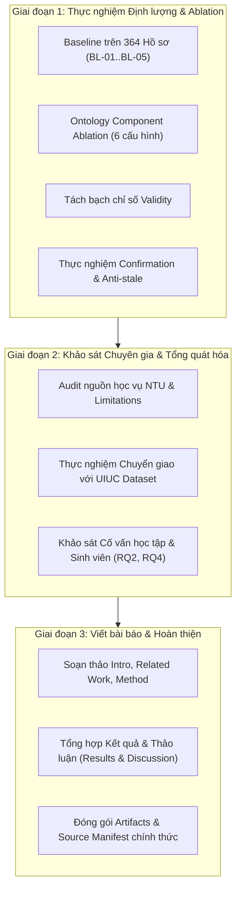

# Kế hoạch Thực hiện Thực nghiệm và Hoàn thiện Bài báo Khoa học

**Hệ thống:** Cố vấn học tập dựa trên Ontology kết hợp AI Agent (Ontology-constrained Agent + Deterministic Validator)  
**Tác giả:** Tấn Đào Duy  
**Ngày lập:** Tháng 10/2026  
**Dựa trên:** Ý kiến chỉ đạo chuyên môn của Giảng viên Hướng dẫn

---

## I. Tổng quan & Định vị Mục tiêu Nghiên cứu

Hệ thống đã đạt độ ổn định kỹ thuật cao: **11/11 kịch bản E2E đạt contract, 202/202 regression tests đạt, Evidence Coverage đạt 100%**, và các luồng tương tác Re-planning / Confirmation đã được tích hợp thành công. 

Tuy nhiên, để đáp ứng đầy đủ tiêu chuẩn của một bài báo khoa học chất lượng cao, trọng tâm giai đoạn này là chuyển dịch từ **Kiểm thử xác minh phần mềm (Software Verification)** sang **Thực nghiệm Khoa học Quy mô lớn (Large-scale Empirical Evaluation)**.

### Định vị các Câu hỏi Nghiên cứu (Research Questions)
* **RQ1 (Vai trò của Ontology & Validator):** Ontology và các ràng buộc tri thức đóng góp như thế nào vào khả năng tìm kiếm kế hoạch học tập hợp lệ của Agent? Được trả lời qua:
  1. So sánh Baseline trên toàn bộ 364 hồ sơ sinh viên ẩn danh (BL-01 đến BL-05).
  2. Phân tích bóc tách thành phần có hệ thống (Ontology Component Ablation Study).
* **RQ2 (Tính cá nhân hóa & Độ phù hợp):** Kế hoạch học tập do Agent đề xuất có đáp ứng đúng nhu cầu và tiến độ học tập thực tế của sinh viên không? Được trả lời qua: Đánh giá của Cố vấn học tập (Advisor Agreement, Acceptance Rate, Edit Distance).
* **RQ3 (Tối ưu hóa xếp hạng theo sở thích - LTR):** *Tạm hoãn huấn luyện mô hình*, ưu tiên thu thập chuẩn hóa tập dữ liệu sở thích (Preference Dataset) từ tương tác thực tế của cố vấn/sinh viên.
* **RQ4 (Tính giải thích được, Tin cậy & Hữu ích):** Lời giải thích dựa trên bằng chứng (Grounded Explanation) có giúp tăng độ minh bạch, độ tin cậy và độ hữu ích không? Được trả lời qua: Đánh giá chuyên gia và sinh viên trên thang đo Likert, độ phủ bằng chứng (Evidence Coverage).
* **Khả năng Tổng quát hóa (Generalization):** Framework Ontology + Validator có chuyển giao được sang chương trình đào tạo khác mà không sửa đổi core logic không? Được trả lời qua: Thực nghiệm trên bộ dữ liệu `University of Illinois Prerequisites Dataset`.

---

## II. Kế hoạch Chi tiết Từng Hạng mục Hành động

---

### Hạng mục 1: Chuẩn hóa Định nghĩa Chỉ số (Metric Disambiguation)

Cần làm rõ dứt khoát trong toàn bộ mã nguồn, tài liệu và bản thảo bài báo hai khái niệm độc lập:

1. **Candidate Attempt Validity (Tỷ lệ ứng viên hợp lệ khi sinh):**
   $$\text{Candidate Attempt Validity} = \frac{N_{\text{valid attempts}}}{N_{\text{total attempts generated before filtering}}}$$
   * *Ý nghĩa:* Phản ánh năng lực định hướng không gian tìm kiếm của thuật toán/Agent nhờ ontology constraints trước khi đưa qua bộ lọc.
   * *Lưu ý quan trọng:* Con số **81,82%** (trong E2E) hoặc **62,87%** (trong BL-05) là Candidate Attempt Validity, **tuyệt đối không được gọi là "Độ chính xác của hệ thống"**.
2. **Final Recommendation Validity (Tỷ lệ kế hoạch hợp lệ phát hành đến người dùng):**
   $$\text{Final Recommendation Validity} = \frac{N_{\text{valid plans released}}}{N_{\text{total plans released}}} = 100\%$$
   * *Ý nghĩa:* Nhờ có cổng chặn tất định (`StandardValidator`), 100% kế hoạch được đề xuất đến người dùng đều hợp lệ.
   * *Chỉ số đi kèm bắt buộc:* **Final Recommendation Coverage** (tỷ lệ sinh viên nhận được ít nhất 1 kế hoạch hợp lệ) và **No-plan Rate** ($1 - \text{Coverage}$). Báo cáo 100% validity mà không báo cáo coverage là không có ý nghĩa khoa học (ví dụ trường hợp BL-04 chỉ phát hành được 1.13% coverage).

---

### Hạng mục 2: Chạy Baseline Quy mô lớn trên 364 Hồ sơ Sinh viên Ẩn danh

* **Dữ liệu thực nghiệm:** Toàn bộ 364 hồ sơ sinh viên ẩn danh (`data/DanhSachSinhVien.json`).
* **Các phương pháp so sánh:**
  * **BL-01:** Rule-based (xếp theo thứ tự học kỳ khuyến nghị).
  * **BL-02:** Greedy Heuristic (chọn tham lam theo điểm heuristic).
  * **BL-03:** Beam Search Heuristic.
  * **BL-04:** Agent không dùng Ontology (chỉ dùng catalog phẳng, không tra cứu tiên quyết, song hành, kỳ mở, quota).
  * **BL-05:** Agent có Ontology (Ontology-constrained Beam Search + Deterministic Validator).
* **Điều kiện kiểm soát nghiêm ngặt (Frozen Conditions):**
  * Cùng seed: 10 seeds ngẫu nhiên (41 đến 50) cho các phương pháp có yếu tố ngẫu nhiên (`BL-03`, `BL-04`, `BL-05`).
  * Cùng budget: Output cap = 3 kế hoạch, Candidate attempts cap = 60, Expanded states cap = 5.000, Timeout = 120s.
  * Target credits cap = 18 tín chỉ; `target_term_id = next-term`.
* **Quy cách báo cáo kết quả:**
  * Báo cáo: `Mean ± SD` và `95% Confidence Interval (CI) half-width`.
  * Bảng so sánh 5 baseline về: Candidate Attempt Validity, Final Recommendation Validity, Final Recommendation Coverage, No-plan Rate, Mean/Median Latency (ms).

---

### Hạng mục 3: Nghiên cứu Bóc tách Thành phần Ontology có Hệ thống (Ontology Component Ablation Study cho RQ1)

Để chứng minh vai trò không thể thay thế của Ontology, thực hiện ablation có hệ thống theo cơ chế: **Bỏ từng quan hệ trong quá trình sinh kế hoạch (Candidate Generation), nhưng giữ nguyên Full Ontology và `StandardValidator` làm bộ đánh giá chuẩn (Ground-truth Evaluator)**.

* **6 Cấu hình Thử nghiệm:**
  1. `Full Ontology`: Đầy đủ mọi quan hệ tri thức (Baseline chuẩn).
  2. `Without Prerequisites`: Bỏ kiểm tra điều kiện học trước / tiên quyết trong sinh kế hoạch.
  3. `Without Corequisites`: Bỏ kiểm tra môn học song hành trong sinh kế hoạch.
  4. `Without Curriculum / Specialization Relations`: Bỏ ràng buộc môn thuộc CTĐT và môn thuộc chuyên ngành.
  5. `Without Semester Offering`: Bỏ ràng buộc kỳ mở môn (môn mở kỳ chẵn/lẻ/cả năm).
  6. `Without Elective Quota`: Bỏ ràng buộc hạn mức tín chỉ tự chọn nhóm/chuyên ngành.
* **Số liệu thu thập & báo cáo:**
  * Chạy trên toàn bộ 364 hồ sơ sinh viên với 10 seeds.
  * Đo lường: Candidate Attempt Validity, Final Recommendation Coverage, No-plan Rate.
  * Ma trận phân loại số vi phạm theo quy tắc (Rule violations breakdown):
    * `prerequisite violations`
    * `corequisite violations`
    * `curriculum_membership violations`
    * `semester_offering violations`
    * `elective_quota violations`
    * `credit_limit violations`
  * Đánh giá mức độ sụt giảm (Delta Drop) để chứng minh trực tiếp cho RQ1.

---

### Hạng mục 4: Mở rộng Thực nghiệm Xác nhận (Confirmation & State Freshness)

Hiện tại mới có 1 ca (SV001 trong E2E-01) chạy luồng confirm, chỉ đóng vai trò smoke test kỹ thuật. Cần mở rộng:

1. **Bộ ca thực nghiệm Đa dạng (Multiple Confirmation Profiles):**
   * Lựa chọn tối thiểu 15-20 hồ sơ đại diện cho các trạng thái học vụ khác nhau: Đúng tiến độ, Nợ môn học lại, Học vượt tải cao, Chưa chọn chuyên ngành, Gần tốt nghiệp.
   * Chạy chu trình hoàn chỉnh: `Initial Plan → Feedback/Adjustment → Re-planning → Final Validation → Confirm`.
   * Ghi nhận: Thời gian thực thi, tỷ lệ thành công của Final Validation, mã xác thực và bằng chứng kiểm định.
2. **Thực nghiệm Chống xác nhận Dữ liệu cũ (Anti-Stale / State Freshness Probe):**
   * Thiết kế ca thử nghiệm đặc thù: Giữa thời điểm sinh kế hoạch và thời điểm người dùng nhấn "Confirm", can thiệp làm thay đổi snapshot nguồn:
     * *Trường hợp A:* Điểm số/lịch sử học tập của sinh viên cập nhật (`student_version` thay đổi).
     * *Trường hợp B:* Quy định học vụ hoặc ontology cập nhật (`knowledge_versions` thay đổi).
   * Chứng minh cơ chế bảo vệ của hệ sinh thái:
     * Hệ thống tự động so khớp hash và phát hiện phiên bản đã cũ (`confirmation_refresh_required = True`).
     * Tuyệt đối không cho phép xác nhận dữ liệu đã mất hiệu lực.
     * Hệ thống tự động kích hoạt một vòng lập kế hoạch mới (`parent_run_id` được ghi nhận) và yêu cầu người dùng xác nhận trên dữ liệu cập nhật mới nhất.

---

### Hạng mục 5: Kế hoạch Khảo sát Chuyên gia & Người dùng (Human Evaluation cho RQ2 & RQ4)

> **Lưu ý chiến lược:** Tạm hoãn triển khai Learning-to-Rank (LTR). Giai đoạn này tập trung hoàn thiện: **Ontology-constrained Agent + Deterministic Validator + Grounded Explanation + Human-in-the-loop Re-planning**. Toàn bộ dữ liệu phản hồi thu thập được sẽ đóng gói thành chuẩn `Preference Dataset` phục vụ giai đoạn phát triển mở rộng tiếp theo.

1. **Chọn mẫu hồ sơ Đại diện (Stratified Sample):**
   * Chọn 30-50 hồ sơ ẩn danh phân bố đều theo:
     * Nhóm 1: Sinh viên năm 1, năm 2 (giai đoạn đại cương/cơ sở ngành).
     * Nhóm 2: Sinh viên năm 3 đã phân chuyên ngành (CNPM, HTTT...).
     * Nhóm 3: Sinh viên có rủi ro tiến độ (nợ môn tiên quyết, GPA thấp).
     * Nhóm 4: Sinh viên học vượt / tải tín chỉ cao.
     * Nhóm 5: Sinh viên năm cuối chuẩn bị tốt nghiệp.
2. **Quy trình Khảo sát Cố vấn học tập (Academic Advisors) & Sinh viên:**
   * Cung cấp giao diện trực quan hiển thị thông tin sinh viên ẩn danh và **Top-3 kế hoạch (Safe, Balanced, Accelerated)** kèm lời giải thích giải trình bằng chứng (Grounded Explanation).
   * Cố vấn và sinh viên đánh giá độc lập theo các tiêu chí:
     * **Tiêu chí 1 - Phương án tối ưu (Best-fit Plan):** Chọn kế hoạch phù hợp nhất trong Top-3 $\rightarrow$ Tính toán chỉ số xếp hạng `NDCG@3` và `MRR`.
     * **Tiêu chí 2 - Mức độ chấp nhận kế hoạch (Plan Acceptance):** Đánh giá theo 3 mức: *Chấp nhận hoàn toàn / Cần điều chỉnh nhỏ / Không thể chấp nhận* $\rightarrow$ Tính `Acceptance Rate`.
     * **Tiêu chí 3 - Số môn cần sửa đổi (Edit Distance):** Ghi nhận số môn học cần thêm/bớt/thay thế $\rightarrow$ Tính toán khoảng cách sửa đổi trung bình giữa đề xuất hệ thống và quyết định của cố vấn.
     * **Tiêu chí 4 - Độ đồng thuận chuyên gia (Advisor Agreement):** Nhiều cố vấn đánh giá cùng một tập hồ sơ $\rightarrow$ Tính toán hệ số tin cậy `Fleiss' Kappa` hoặc `Cohen's Kappa`.
     * **Tiêu chí 5 - Chất lượng Lời giải thích (Grounded Explanation Quality):**
       * Tính rõ ràng, dễ hiểu (Clarity of Explanation).
       * Độ bám sát bằng chứng (Claim-Evidence Adherence) và Độ phủ bằng chứng (Evidence Coverage).
     * **Tiêu chí 6 - Thang đo Likert (1 đến 5 điểm):** Đánh giá về Độ hữu ích (Usefulness) và Độ tin cậy (Trust).

---

### Hạng mục 6: Rà soát & Chuẩn hóa Nguồn Dữ liệu Học vụ (NTU Source Audit & Limitations)

1. **Rà soát và Thu thập Văn bản Chính thức:**
   * Quy chế đào tạo đại học chính quy theo hệ thống tín chỉ của Trường Đại học Nha Trang: Xác định quyết định ban hành, khung đăng ký tín chỉ tối thiểu (10 tín chỉ) và tối đa (24-27 tín chỉ).
   * Khung CTĐT ngành Công nghệ Thông tin và các chuyên ngành (Kỹ thuật phần mềm, Hệ thống thông tin...): Rà soát danh mục môn bắt buộc, môn tự chọn, hạn mức tín chỉ tự chọn nhóm (Elective Quotas).
   * Chu kỳ mở môn học (`openSemesterType`): Đối chiếu với kế hoạch năm học chính thức của Phòng Đào tạo.
2. **Khai báo Minh bạch Hạn chế Nghiên cứu (Limitations):**
   * Mọi quy định/thông số học vụ chưa có văn bản ký duyệt chính thức (ví dụ: quy ước `next-term = current_semester + 1`, proxy cảnh báo rủi ro tiến độ, trọng số heuristic...) phải được ghi nhận rõ ràng là **Research Proxy / Provisional Setting** trong phần `Limitations` của bài báo, không được trình bày như quy định chính thức của Trường.

---

### Hạng mục 7: Thử nghiệm Khả năng Tổng quát hóa (Generalization trên University of Illinois Dataset)

* **Bộ dữ liệu mục tiêu:** `University of Illinois Prerequisites Dataset` (`uiuc-prerequisites.csv` từ GitHub `illinois/prerequisites-dataset`).
* **Mục tiêu thực nghiệm:** Kiểm tra tính độc lập và khả năng chuyển giao (Cross-curriculum transferability) của mô hình Ontology và cơ chế `StandardValidator` trên một cấu trúc chương trình đào tạo hoàn toàn khác mà không thay đổi mã nguồn cốt lõi.
* **Quy trình triển khai 4 bước:**
  1. **Trích xuất & Làm sạch Dữ liệu:** Đọc `uiuc-prerequisites.csv`, chuẩn hóa mã môn học, số lượng tiên quyết và danh sách môn tiên quyết tương ứng.
  2. **Ánh xạ sang Ontology (RDF Mapping):** Chuyển đổi toàn bộ quan hệ môn học và tiên quyết của UIUC sang đồ thị tri thức OWL/RDF theo đúng ontology schema của hệ thống (lớp `Course`, thuộc tính `hasPrerequisite`, số tín chỉ giả định chuẩn).
  3. **Sinh Tập Hồ sơ Sinh viên Giả lập (Synthetic Student Cohort):**
     * Tạo 50-100 hồ sơ sinh viên giả lập với các trạng thái học vụ khác nhau trên CTĐT của UIUC (sinh viên năm 1 chưa học gì, sinh viên năm 2 đã học các môn nhập môn CS, sinh viên nợ môn cốt lõi...).
  4. **Thực thi và Đánh giá:**
     * Chạy Agent và Validator trên đồ thị tri thức UIUC.
     * Kiểm tra:
       * Agent có tự động nhận diện cây tiên quyết mới để sinh kế hoạch hợp lệ không?
       * Validator có phát hiện chính xác 100% các vi phạm tiên quyết trên curriculum UIUC không?
     * So sánh Candidate Attempt Validity và Final Recommendation Validity trên dataset UIUC.

---

## III. Lộ trình Thực hiện (Timeline & Milestones - 4 Tuần)

| Giai đoạn | Thời gian | Nhiệm vụ Trọng tâm | Đầu ra (Deliverables) |
|---|---|---|---|
| **Tuần 1** | Ngày 1 - 7 | - Chạy toàn bộ 5 Baseline (BL-01..BL-05) trên 364 hồ sơ, 10 seeds. - Chạy Ontology Component Ablation (6 cấu hình) trên 364 hồ sơ. - Viết script mở rộng thử nghiệm Confirmation (15-20 profiles) và thử nghiệm Anti-stale. | - Bảng dữ liệu Baselines (Mean ± SD, 95% CI). - Bảng dữ liệu Ontology Ablation Study. - Báo cáo kết quả Confirmation & Freshness verification. |
| **Tuần 2** | Ngày 8 - 14 | - Tải và xây dựng pipeline chuyển đổi `UIUC Prerequisites Dataset` sang Ontology. - Chạy thử nghiệm Generalization trên đồ thị UIUC. - Hoàn thiện biểu mẫu khảo sát Cố vấn học tập và Sinh viên. - Rà soát đối chiếu văn bản học vụ NTU, cập nhật `source_manifest.json` và tài liệu Limitations. | - Module chuyển đổi và kết quả thực nghiệm UIUC Dataset. - Bộ câu hỏi và biểu mẫu khảo sát Advisor/Student hoàn chỉnh. - Báo cáo audit nguồn học vụ NTU. |
| **Tuần 3** | Ngày 15 - 21 | - Phối hợp cùng GVHD phát phiếu/mở giao diện thu thập ý kiến Cố vấn học tập và Sinh viên. - Bắt đầu viết bản thảo bài báo: Section 1 (Introduction), Section 2 (Related Work), Section 3 (System Architecture & Methodology), Section 4 (Experimental Design). | - Dữ liệu thô khảo sát từ Cố vấn & Sinh viên. - Bản thảo thô các phần 1, 2, 3, 4 của bài báo. |
| **Tuần 4** | Ngày 22 - 28 | - Xử lý thống kê dữ liệu khảo sát (Advisor Agreement, Acceptance Rate, Edit Distance, Likert Trust/Usefulness). - Hoàn thiện Section 5 (Results & Discussion) và Section 6 (Conclusion & Limitations). - Đóng gói toàn bộ Artifacts thực nghiệm. | - Bản thảo hoàn chỉnh bài báo khoa học. - Bộ hồ sơ báo cáo tiến độ và bảng số liệu gửi GVHD. |

---

## IV. Danh mục Sản phẩm Nộp Báo cáo Lần tới cho Giảng viên Hướng dẫn

1. **Bảng kết quả Baseline trên tập hồ sơ lớn (364 hồ sơ):**
   * Bảng so sánh 5 thuật toán (BL-01 đến BL-05) với đầy đủ các cột: Candidate Attempt Validity, Final Recommendation Validity, Final Recommendation Coverage, No-plan Rate, Latency.
   * Số liệu Mean ± SD và 95% CI cho các thuật toán ngẫu nhiên.
2. **Bảng Ontology Component Ablation Study:**
   * So sánh định lượng giữa Full Ontology và 5 cấu hình khuyết tật (-Prerequisite, -Corequisite, -Specialization, -Offering, -Quota).
   * Số lượng vi phạm phân theo từng quy tắc cụ thể $\rightarrow$ Bằng chứng cốt lõi cho RQ1.
3. **Báo cáo phân tách rạch ròi 2 chỉ số Validity:**
   * Giải thích tường minh toán học và vai trò của cổng chặn tất định `StandardValidator`.
4. **Báo cáo thực nghiệm chu trình Confirmation:**
   * Kết quả chạy trên tập đa dạng hồ sơ; bằng chứng xác minh cơ chế chống xác nhận dữ liệu cũ (Anti-stale protection).
5. **Kế hoạch & Biểu mẫu Khảo sát Cố vấn / Sinh viên:**
   * Chi tiết thang đo, rubric đánh giá, phương pháp chọn mẫu và công thức thống kê (Agreement, Acceptance, Edit Distance, NDCG@3, Likert).
6. **Báo cáo sơ bộ về thử nghiệm Tổng quát hóa với UIUC Dataset & Rà soát nguồn học vụ NTU.**
