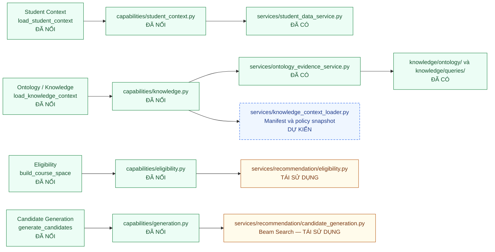
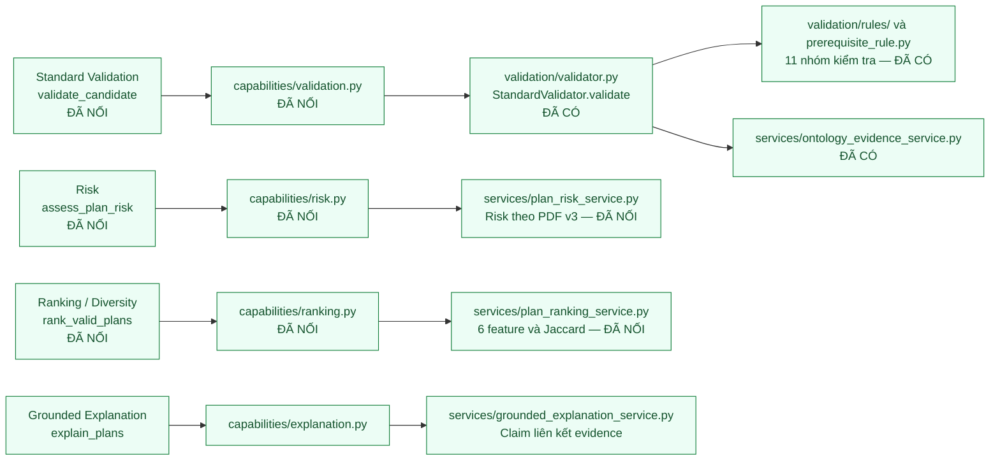
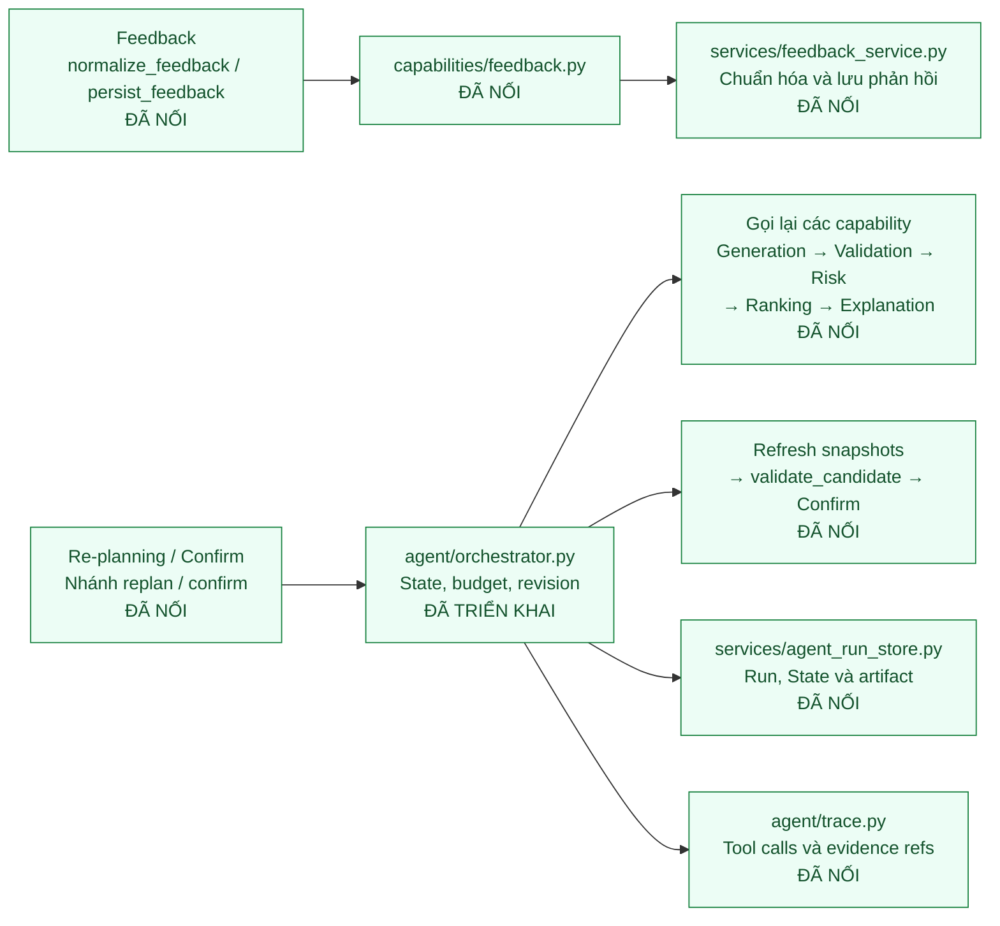

# Sơ đồ mapping capability → tool → module

Cập nhật theo source ngày 2026-09-14. Sơ đồ phục vụ báo cáo kiến trúc MVP; Orchestrator, State, trace, run store, capability adapters và AgentPipeline đã được triển khai. Module ghi “đã có” là phần tái sử dụng hoặc capability đã nối; giới hạn dữ liệu nguồn vẫn được nêu riêng, không suy diễn thành chính sách chính thức.

Đường dẫn Python tính từ `backend/app/`; đường dẫn `knowledge/` tính từ gốc repository. Mỗi sơ đồ đọc từ trái sang phải: **capability và tên tool → adapter → module nghiệp vụ/nguồn**.

- **Xanh lá — ĐÃ NỐI:** capability/module đang được AgentPipeline dùng.
- **Vàng — TÁI SỬ DỤNG:** source cũ còn được bọc bởi capability.
- **Xanh dương, viền đứt — CÒN THIẾU:** hạng mục chưa có, chủ yếu là source-loader xác minh policy chính thức.
- Mũi tên thể hiện quan hệ gọi/tái sử dụng; thứ tự runtime được kiểm soát bởi AgentOrchestrator.

## 1. Student Context, Ontology, Eligibility và Generation

Student Context tạo hồ sơ tại học kỳ đích. Knowledge capability tạo snapshot/evidence và giữ manifest/hash; loader xác minh artifact nguồn chính thức còn thiếu. Eligibility trả trạng thái từng môn cùng evidence; Generation trả candidate/attempt trace, chưa kết luận validity. Các capability nhận snapshot tường minh.

## 2. Validator, Risk, Ranking và Grounded Explanation

Validator độc lập, không gọi LLM/Agent/Generator; chỉ `valid` trên đúng candidate/snapshot được chuyển tiếp. Risk chạy trước Ranking vì Safety là feature. `services/recommendation/plan_risk.py` và `services/explanation_generator.py` hiện có là phiên bản cũ để tham khảo; chưa đáp ứng công thức Risk PDF v3 hoặc chuỗi claim → evidence mới.

## 3. Feedback, Re-planning và Confirm

Re-planning là nhánh điều phối của Orchestrator, không phải generator hoặc bộ luật thứ hai. Feedback tạo adjustment/selection intent; không sửa trực tiếp candidate hoặc ontology. Orchestrator gọi toàn bộ capability ở các sơ đồ trên theo State và là thành phần duy nhất cập nhật State. Khi confirm, chỉ ghi xác nhận sau Final Validation hợp lệ và kiểm tra revision nguồn.

## 4. Schema và contract dùng chung

| Phạm vi | Module/schema | Trạng thái |
|---|---|---|
| Request và candidate | `schemas/planning.py`: PlanningRequest, CandidatePlan | Đã có |
| Student/knowledge snapshots | `schemas/snapshot.py`, `schemas/common.py` | Đã có; loader nguồn còn cần triển khai |
| Ontology và rule evidence | `schemas/evidence.py`: EvidenceRecord, OntologyFactEvidence | Đã có |
| Kết luận Validator | `schemas/validation.py`: ValidationResult | Đã có |
| Envelope, lỗi, provenance | `schemas/capability.py` | Đã có |
| Agent State | `schemas/agent_state.py` | Đã có |
| Features và Ranking Result | `schemas/ranking.py` | Đã có và được AgentPipeline dùng |
| Feedback và adjustment | `schemas/feedback.py`, `capabilities/feedback.py`, `services/feedback_service.py` | Đã nối qua AgentPipeline |

Mỗi tool phải có input/output schema, precondition, postcondition, xử lý lỗi và provenance. Quyết định học vụ lưu nguồn/version và evidence từ triple, query hoặc rule; explanation tham chiếu lại evidence. Bảng contract chi tiết nằm tại [đặc tả MVP, mục 3–5](DAC_TA_TRIEN_KHAI_MVP.md).

## 5. Phạm vi hoàn thành của tài liệu

**Source hiện có ontology, engine, schemas, StandardValidator, AgentState, feedback schema, trace, run store, adapters và AgentPipeline tích hợp.** API Agent tại `/api/agent/runs` dùng AgentPipeline; endpoint recommendation cũ vẫn giữ RecommendationEngine cho tương thích và không phải bằng chứng thay thế pipeline Agent.

Trạng thái trên được đối chiếu với source và test pipeline/API. Các hạng mục nguồn chính thức còn thiếu phải tiếp tục được ghi rõ, không suy diễn từ việc capability đã tích hợp.

Tham chiếu: [bảng mapping](DAC_TA_TRIEN_KHAI_MVP.md#2-mapping-capability--tool--module), [kế hoạch M0–M7](KE_HOACH_TRIEN_KHAI_AGENT_MVP.md), [cấu trúc engine hiện có](../backend/app/services/recommendation/README.md).
