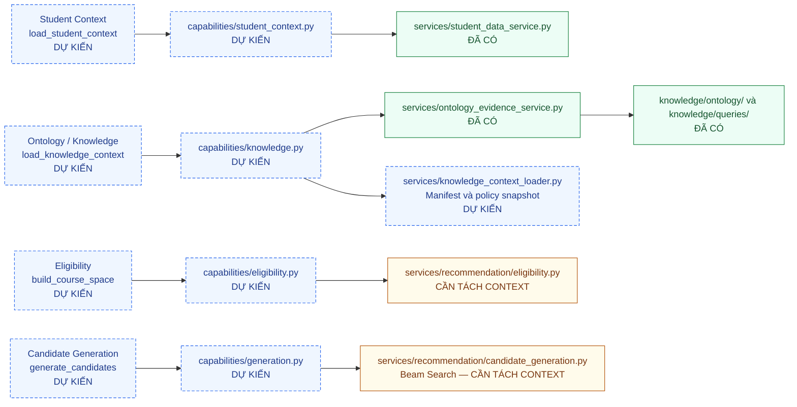
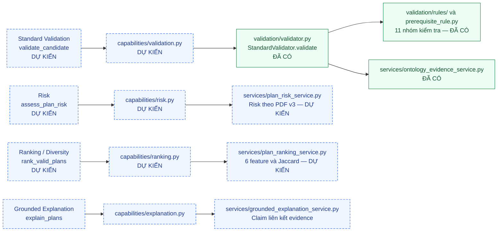
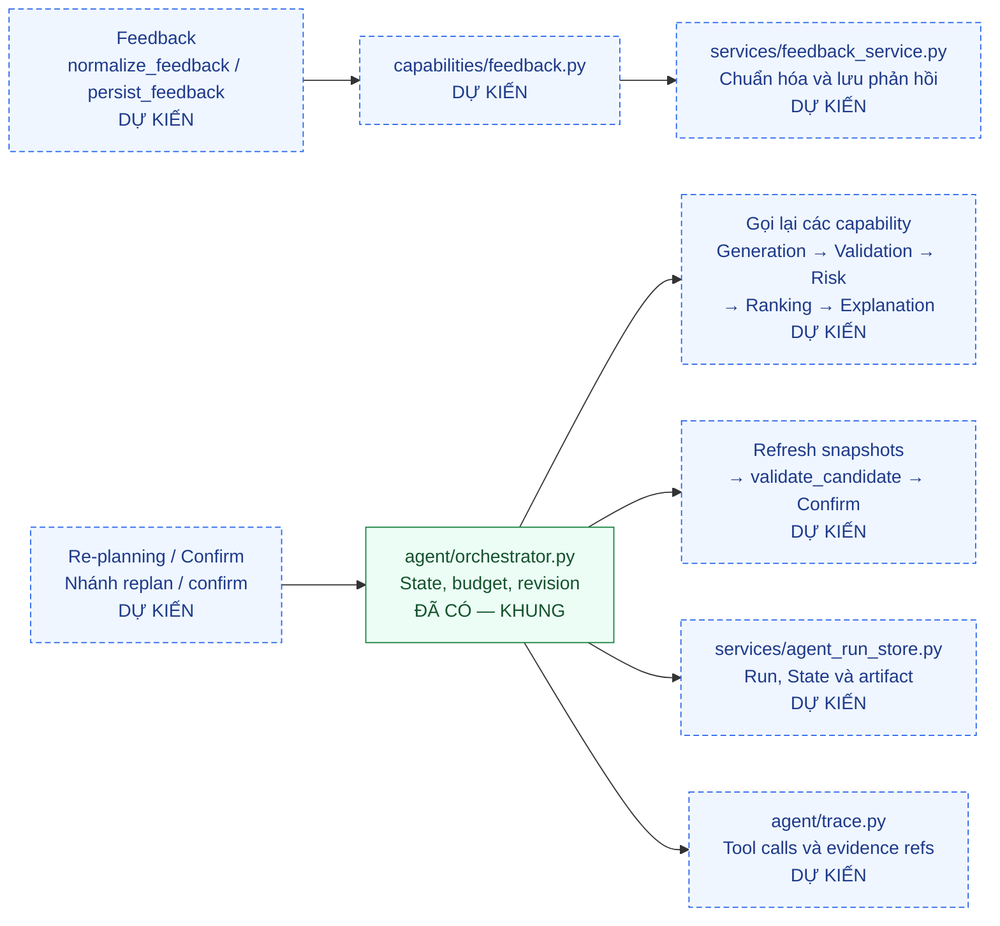

# Sơ đồ mapping capability → tool → module

Cập nhật theo source ngày 2026-09-08. Sơ đồ phục vụ báo cáo kiến trúc MVP; khung Orchestrator, State, trace và run store đã được triển khai. Các tool/adapter nghiệp vụ bên dưới vẫn chưa được nối; module ghi “đã có” là phần tái sử dụng, chưa đồng nghĩa đã đáp ứng capability contract.

Đường dẫn Python tính từ `backend/app/`; đường dẫn `knowledge/` tính từ gốc repository. Mỗi sơ đồ đọc từ trái sang phải: **capability và tên tool → adapter → module nghiệp vụ/nguồn**.

- **Xanh lá — ĐÃ CÓ:** source hoặc tài nguyên đang tồn tại.
- **Vàng — CẦN TÁCH:** source đã có nhưng còn dùng chung context của engine.
- **Xanh dương, viền đứt — DỰ KIẾN:** tool, adapter hoặc module cần triển khai.
- Mũi tên thể hiện quan hệ gọi/tái sử dụng dự kiến, không phải thứ tự thực thi hay bằng chứng đã tích hợp.

## 1. Student Context, Ontology, Eligibility và Generation

Student Context tạo hồ sơ tại học kỳ đích. Knowledge loader xác minh manifest/hash và chính sách nguồn. Eligibility trả trạng thái từng môn cùng evidence; Generation trả candidate/attempt trace, chưa kết luận validity. Eligibility và Generation phải nhận snapshot tường minh thay cho live context của engine.

## 2. Validator, Risk, Ranking và Grounded Explanation

Validator độc lập, không gọi LLM/Agent/Generator; chỉ `valid` trên đúng candidate/snapshot được chuyển tiếp. Risk chạy trước Ranking vì Safety là feature. `services/recommendation/plan_risk.py` và `services/explanation_generator.py` hiện có là phiên bản cũ để tham khảo; chưa đáp ứng công thức Risk PDF v3 hoặc chuỗi claim → evidence mới.

## 3. Feedback, Re-planning và Confirm

Re-planning là nhánh điều phối của Orchestrator, không phải generator hoặc bộ luật thứ hai. Feedback tạo adjustment/selection intent; không sửa trực tiếp candidate hoặc ontology. Orchestrator gọi toàn bộ capability ở các sơ đồ trên theo State và là thành phần duy nhất cập nhật State. Khi confirm, chỉ ghi xác nhận sau Final Validation hợp lệ và kiểm tra revision nguồn.

## 4. Schema và contract dùng chung

| Phạm vi | Module/schema | Trạng thái |
|---|---|---|
| Request và candidate | `schemas/planning.py`: PlanningRequest, CandidatePlan | Đã có |
| Student/knowledge snapshots | `schemas/snapshot.py`, `schemas/common.py` | Đã có; loader nguồn còn cần triển khai |
| Ontology và rule evidence | `schemas/evidence.py`: EvidenceRecord, OntologyFactEvidence | Đã có |
| Kết luận Validator | `schemas/validation.py`: ValidationResult | Đã có |
| Envelope, lỗi, provenance | `schemas/capability.py` | Đã có |
| Agent State | `schemas/agent_state.py` | Đã có |
| Features và Ranking Result | `schemas/ranking.py` | Dự kiến |
| Feedback và adjustment | `schemas/feedback.py` | Dự kiến |

Mỗi tool phải có input/output schema, precondition, postcondition, xử lý lỗi và provenance. Quyết định học vụ lưu nguồn/version và evidence từ triple, query hoặc rule; explanation tham chiếu lại evidence. Bảng contract chi tiết nằm tại [đặc tả MVP, mục 3–5](DAC_TA_TRIEN_KHAI_MVP.md).

## 5. Phạm vi hoàn thành của tài liệu

**Đã hoàn thành sơ đồ mapping thiết kế để đưa vào báo cáo.** Source hiện có ontology, engine, schemas thành phần, StandardValidator, AgentState, feedback schema, trace, run store và khung Orchestrator; chưa có các adapter capability và luồng Agent tích hợp. API hiện tại vẫn gọi RecommendationEngine cũ.

Khi một capability được code: đối chiếu đường dẫn thực tế, cập nhật trạng thái node, bổ sung tên test và run/trace chứng minh đã tích hợp. Không đổi nhãn sang “đã có” chỉ vì tạo file rỗng.

Tham chiếu: [bảng mapping](DAC_TA_TRIEN_KHAI_MVP.md#2-mapping-capability--tool--module), [kế hoạch M0–M7](KE_HOACH_TRIEN_KHAI_AGENT_MVP.md), [cấu trúc engine hiện có](../backend/app/services/recommendation/README.md).
