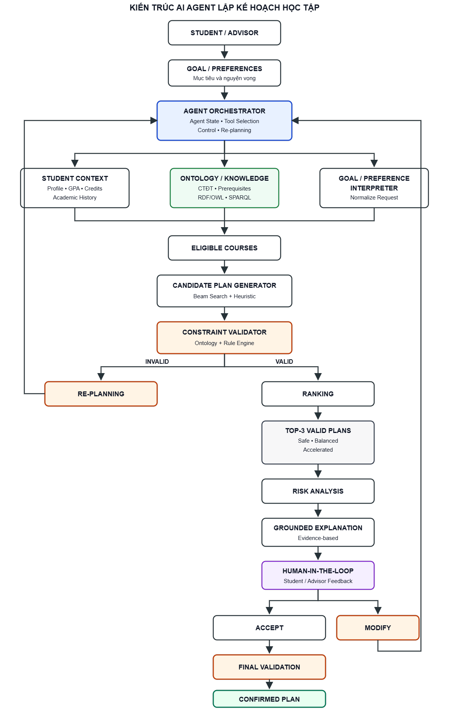
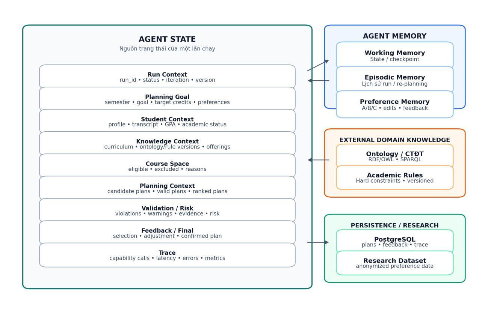

# THIẾT KẾ AI AGENT LẬP KẾ HOẠCH HỌC TẬP

> Nguồn thiết kế gốc: [TÀI LIỆU THIẾT KẾ AI AGENT LẬP KẾ HOẠCH HỌC TẬP_v3.pdf](<TÀI LIỆU THIẾT KẾ AI AGENT LẬP KẾ HOẠCH HỌC TẬP_v3.pdf>). Cập nhật ngày 2026-09-08: thống nhất Ranking theo PDF v3; contract triển khai được bổ sung trong Markdown. Chi tiết đủ để code và các tham số **đề xuất, chưa kiểm chứng thực nghiệm** nằm trong [đặc tả triển khai MVP](DAC_TA_TRIEN_KHAI_MVP.md).

## 1. Mục đích

Tài liệu trình bày thiết kế tổng thể của **AI Agent hỗ trợ lập kế hoạch học tập cá nhân hóa dựa trên Ontology**. Nội dung tập trung vào kiến trúc Agent, các capability nghiệp vụ, cấu trúc Agent State và Memory, quy trình Planning–Validation–Re-planning, ba loại phương án học tập và kế hoạch thực nghiệm so sánh.

Mục đích của tài liệu là xác định rõ cách Agent tiếp nhận mục tiêu người học, điều phối các công cụ, sinh và xếp hạng nhiều phương án, kiểm tra ràng buộc, giải thích kết quả và cập nhật kế hoạch theo phản hồi của sinh viên hoặc cố vấn. Thiết kế này cần được thống nhất trước khi triển khai để bảo đảm hệ thống được phát triển thành một AI Agent có khả năng lập kế hoạch và sử dụng công cụ, không chỉ là một chatbot giao tiếp bằng ngôn ngữ tự nhiên.

Hệ thống tuân theo các nguyên tắc sau:

- Ontology và Rule Engine là nguồn quyết định tính hợp lệ của kế hoạch học tập.
- Agent Orchestrator quản lý State và điều phối các capability theo từng giai đoạn xử lý.
- Candidate Plan Generator chỉ sinh phương án ứng viên; Constraint Validator thực hiện kiểm tra độc lập trước khi Ranking.
- LLM chỉ hỗ trợ diễn giải mục tiêu, phản hồi và kết quả đã có căn cứ; không được tự tạo học phần, tín chỉ, quan hệ tiên quyết hoặc quy định học vụ.
- Chỉ các phương án vượt qua Validation mới được xếp hạng, giải thích và hiển thị cho người dùng.
- Ranking và Learning-to-Rank chỉ thay đổi thứ tự ưu tiên, không được thay đổi Ontology, Rules hoặc hard constraints.
- Mọi phương án phát sinh sau phản hồi hoặc Re-planning phải được Validation lại trước khi hiển thị hoặc xác nhận.

### 1.1. Đóng góp nghiên cứu dự kiến

Nghiên cứu tập trung vào ba đóng góp chính.

1. **Ontology-constrained AI Agent:** Ontology và Rule Engine quyết định tính hợp lệ của kế hoạch học tập. Agent điều phối truy xuất tri thức, sinh phương án, kiểm tra ràng buộc, xếp hạng và lập kế hoạch lại; không trực tiếp tự suy luận hoặc thay đổi ràng buộc học vụ. Cơ chế này nhằm giảm và phát hiện phương án vi phạm tiên quyết, song hành, chuyên ngành, học kỳ mở, giới hạn tín chỉ và quota nhóm môn.
2. **Grounded Explanation dựa trên Ontology Evidence:** mỗi giải thích phải truy vết được về evidence cụ thể từ Ontology, kết quả SPARQL hoặc Rule Engine. LLM chỉ diễn đạt evidence thành ngôn ngữ tự nhiên, không tự tạo lý do ngoài căn cứ được cung cấp.
3. **Human-in-the-loop Preference Learning:** khai thác lựa chọn và phản hồi của sinh viên hoặc cố vấn để học cách xếp hạng lại phương án hợp lệ. Preference Learning chỉ tác động đến thứ tự ưu tiên sau Validator, không thay đổi Ontology, Rule Engine hoặc hard constraints.

## 2. Sơ đồ kiến trúc AI Agent



### 2.1. Vai trò của Agent Orchestrator

- Chuẩn hóa planning goal.
- Khởi tạo Run Context và Student Context.
- Chọn capability theo trạng thái.
- Điều phối truy vấn tri thức, sinh phương án, Validation và Ranking.
- Dừng nhánh lỗi hoặc thiếu dữ liệu.
- Chuyển plan hợp lệ tới Explanation và Human-in-the-loop.
- Cập nhật feedback, iteration và kích hoạt Re-planning.
- Ghi Evidence/Trace để tái lập và đánh giá.

Agent Orchestrator không trực tiếp quyết định quy tắc học vụ. Ontology và Rule Engine vẫn là nguồn quyết định tính hợp lệ.

## 3. Công nghệ và các capability

### 3.1. Technology Stack

| Lớp | Công nghệ | Trạng thái |
|---|---|---|
| Agent | LangGraph, Pydantic | Schemas Pydantic thành phần đã có; Orchestrator/LangGraph chưa triển khai |
| Knowledge | RDF/OWL, Protégé, RDFLib, SPARQL | Đang dùng một phần |
| Planning | Python, Beam Search, heuristic | Đang dùng |
| Validation | Python Rule Engine + Ontology | StandardValidator v3 độc lập đã có; chưa nối capability/Agent |
| Data | PostgreSQL, SQLAlchemy | Kiến trúc đích; hiện dùng JSON/CSV |
| Backend | Flask | Đang dùng |
| Testing | Pytest | Đang dùng |
| Future | LTR, pgvector/RAG, LLM | Mở rộng |

### 3.2. Agent Capabilities

| Capability | Trách nhiệm | State output |
|---|---|---|
| Student Context | Hồ sơ, lịch sử, GPA, tín chỉ, cảnh báo | Student Context |
| Ontology | CTĐT và quan hệ học phần | Knowledge Context, Evidence |
| Eligibility | Môn đủ điều kiện và bị loại | Course Space |
| Candidate Generator | Sinh Safe/Balanced/Accelerated | Candidate Plans |
| Validator | Kiểm tra hard constraints | Validation Results |
| Ranking | Chấm điểm và chọn Top-3 hợp lệ | Ranked Plans |
| Risk | Phân tích tiến độ và tải học | Risk Results |
| Explanation | Giải thích từ evidence | Explanations |
| Feedback/Re-planning | Chuẩn hóa phản hồi và lập lại | Feedback, Adjustment Request |

Danh sách trên mô tả capability logic. Mapping module/tool và schema triển khai dự kiến được chốt tại mục 3.3 và tài liệu liên kết; không đồng nghĩa các capability đã được code.

### 3.3. Đặc tả Capability và Tool Contract

Mỗi capability là một đơn vị chức năng do Agent Orchestrator điều phối, phải công bố **input schema, output schema, precondition, postcondition, timeout, error handling và provenance**. Capability chỉ trả output thuộc phạm vi trách nhiệm; Orchestrator là thành phần duy nhất áp dụng output vào Agent State và quyết định chuyển trạng thái. Contract độc lập với cách gọi Python, LangGraph hoặc adapter tool của LLM.

| Capability | Input chính | Output chính | Precondition | Postcondition | Provenance chính |
|---|---|---|---|---|---|
| Student Context | Student ID, học kỳ đích | StudentSnapshot, source manifest | Hồ sơ và lịch học xác định | Snapshot nhất quán, chỉ dùng lịch sử trước học kỳ đích | studentVersion, source hash, cutoff |
| Ontology/Knowledge | StudentSnapshot, CTĐT/học kỳ | KnowledgeContext, Evidence | Nguồn tri thức và phiên bản xác định | Dữ kiện đầy đủ theo manifest, truy vết được | ontology/rule/curriculum/offering version, query ID/hash |
| Eligibility | Student/Knowledge Context | CourseSpace | Snapshot hợp lệ | Phân biệt eligible, conditional, ineligible, unknown; có evidence | Rule inputs, fact IDs |
| Candidate Generator | CourseSpace, request, adjustment, seed/budget | CandidatePlans, generation trace | CourseSpace đủ dữ liệu | Sinh 0..budget candidate, chưa khẳng định validity | Generator/config version, seed, snapshots |
| Standard Validator | Candidate, snapshots, credit policy | ValidationResult | Schema hợp lệ, đúng nội dung nguồn | Trả valid/invalid/partially_validated/error; chỉ valid đi tiếp | Plan hash, ontology/rule/config version, evidence |
| Risk Analysis | ValidatedPlan, Student Context, RankingContext | RiskResult | Validation còn hiệu lực | Điểm và thành phần rủi ro có căn cứ; không đổi validity | Risk version, inputs, assumptions |
| Ranking | ValidatedPlans, RiskResults, request/context/config | RankingResult | Plan valid, đủ feature, cùng versions | Điểm thành phần/tổng và tối đa ba phương án khác biệt | Ranking/config/feature version, validation hash |
| Explanation | Selected plans, Validation, Ranking, Evidence | GroundedExplanation | Mọi tham chiếu giải được và đúng version | Claim liên kết decision/evidence đúng nội dung | Claim/decision/evidence IDs, template version |
| Feedback | Feedback, displayed result, request | AdjustmentRequest hoặc selection intent | Phản hồi có kiểu, kết quả chưa stale | Không sửa candidate/knowledge; persist idempotent | Feedback ID, parent result, actor role |
| Re-planning | Adjustment hoặc validation diagnostics | Vòng điều phối mới | Còn budget, dữ kiện đủ | Gọi lại generator và Validator, rồi risk/rank/explain | Iteration và chuỗi tool calls |

Mapping tới module/tool, schema trường, timeout cụ thể, lỗi và quy tắc retry được quy định tại [mục 2–5 của đặc tả triển khai](DAC_TA_TRIEN_KHAI_MVP.md). Risk chạy **trước Ranking** vì safety là feature; Feedback và Re-planning được tách trách nhiệm. Final Validation dùng lại StandardValidator trên nguồn hiện hành.

Nếu precondition không thỏa, capability trả lỗi có cấu trúc cho Orchestrator, không suy đoán dữ kiện học vụ hoặc nới hard constraints. Plan invalid là kết luận nghiệp vụ; lỗi nguồn, timeout và chưa kiểm tra đủ phải được phân biệt. Output ảnh hưởng đến quyết định giữ đủ input hash, nguồn/version, cấu hình và evidence để tái lập. Trọng số Ranking và heuristic Risk là quyết định thiết kế có phiên bản, không được ghi thành fact ontology.

## 4. Agent State và Agent Memory



### 4.1. Mô hình formal State–Action–Tool

Trạng thái của một lần chạy tại bước t được biểu diễn bởi:

> **Công thức 1:** Sₜ = ⟨r, g, x, k, cₜ, vₜ, zₜ, fₜ, eₜ, iₜ⟩

| Ký hiệu | Ý nghĩa |
|---|---|
| r | Run Context: mã lần chạy, trạng thái và thời điểm thực hiện |
| g | Planning Goal: học kỳ, mục tiêu học tập và số tín chỉ mong muốn |
| x | Student Context: bản chụp hồ sơ và lịch sử học tập |
| k | Knowledge Context: bản chụp tri thức và phiên bản dữ liệu |
| cₜ | Tập kế hoạch ứng viên tại bước t |
| vₜ | Kết quả kiểm tra tính hợp lệ |
| zₜ | Danh sách kế hoạch đã được xếp hạng |
| fₜ | Phản hồi của sinh viên hoặc cố vấn |
| eₜ | Evidence và dấu vết thực thi |
| iₜ | Số vòng Planning/Re-planning đã thực hiện |

Một snapshot bất biến được xác định bởi:

> **Công thức 2:** KVersion = ⟨studentVersion, curriculumVersion, ontologyVersion, ruleVersion, offeringVersion⟩

Việc lưu đầy đủ các phiên bản giúp tái lập kết quả và phát hiện trường hợp dữ liệu nguồn thay đổi.

Tập hành động điều phối của Agent được định nghĩa như sau:

> **Công thức 3:** A = {LoadContext, QueryKnowledge, BuildCourseSpace, Generate, Validate, Rank, Explain, CollectFeedback, Replan, FinalValidate, Stop}

Mỗi tool hoặc capability Tⱼ được biểu diễn bởi:

> **Công thức 4:** Tⱼ: Iⱼ → Oⱼ ∪ Errorⱼ

Trong đó Iⱼ là dữ liệu đầu vào, Oⱼ là dữ liệu đầu ra hợp lệ và Errorⱼ là tập lỗi có thể xảy ra. Mỗi tool phải công bố input schema, output schema, precondition, postcondition, timeout và provenance.

Hàm chuyển trạng thái của Agent được biểu diễn như sau:

> **Công thức 5:** Sₜ₊₁ = δ(Sₜ, aₜ, Oⱼ)

Trong đó aₜ là hành động tại bước t và Oⱼ là kết quả do tool trả về. Chỉ Agent Orchestrator được phép áp dụng hàm chuyển trạng thái δ; các tool riêng lẻ không được tự ý sửa toàn bộ Agent State.

Các bất biến an toàn:

1. Rank và Explain chỉ được thực hiện khi Validator đã kết luận kế hoạch hợp lệ trên đúng phiên bản knowledge snapshot.
2. Confirm chỉ được thực hiện khi Final Validation trên phiên bản dữ liệu hiện hành trả về kết quả hợp lệ.
3. Khi candidate plan hoặc snapshot thay đổi, các kết quả Validation, Ranking và Explanation phụ thuộc phải bị vô hiệu hóa và thực hiện lại.
4. Feedback chỉ cập nhật preference hoặc adjustment request; không được thay đổi knowledge snapshot, Ontology, Rule Engine hoặc nhãn hard constraint.
5. Ranking và Learning-to-Rank chỉ thay đổi thứ tự của các kế hoạch hợp lệ, không được ghi đè kết luận của Validator.

### 4.2. Cấu trúc Agent State

| Nhóm | Nội dung |
|---|---|
| Run Context | Run ID, status, iteration, giới hạn vòng, thời điểm |
| Planning Goal | Học kỳ, mục tiêu, tín chỉ, môn ưu tiên/tránh |
| Student Context | Hồ sơ, lịch sử, GPA, tín chỉ, cảnh báo |
| Knowledge Context | Phiên bản ontology/rule, CTĐT, môn mở, quan hệ |
| Course Space | Môn đủ điều kiện, bị loại và lý do |
| Candidate Plans | Tổ hợp ứng viên và loại phương án |
| Validation Results | Validity, violation, warning, evidence |
| Ranked Plans | Top-3, tổng điểm và điểm thành phần |
| Feedback | Lựa chọn, thứ hạng, điều chỉnh, xác nhận |
| Evidence / Trace | Căn cứ, lịch sử capability, thời gian, lỗi |
| Final Result | Plan chọn và kiểm tra cuối |

### 4.3. Cơ chế cập nhật State

- Khởi tạo từ yêu cầu hợp lệ và snapshot.
- Capability chỉ trả phần output thuộc trách nhiệm; Orchestrator kiểm tra và cập nhật State.
- Câu chữ phải được chuẩn hóa trước khi cập nhật.
- Mỗi vòng giữ iteration/version và trace cũ.
- Candidate Plans có trước Validation Results.
- Chỉ plan hợp lệ được đưa vào Ranked Plans.
- Feedback tạo Adjustment Request, không sửa trực tiếp plan.
- Nguồn dữ liệu thay đổi làm mất hiệu lực kết quả phụ thuộc.
- Final Result chỉ được tạo sau Final Validation.

### 4.4. Agent Memory

| Thành phần | Nội dung |
|---|---|
| Working Memory | Request, snapshots, candidates, Validation, Ranking và feedback của một lần chạy |
| Episodic Memory | Lịch sử lập kế hoạch, phương án đã xem, vòng chỉnh sửa và quyết định cuối |
| Preference Memory | Lựa chọn A/B/C, thứ hạng, môn thêm/loại/thay và lý do cố vấn |
| External Domain Knowledge: Ontology + Rules | CTĐT, quan hệ học phần và Rules đã được phê duyệt |

External Domain Knowledge là nguồn tri thức bên ngoài, không phải ký ức do Agent học được. Preference Memory phải được ẩn danh và không được dùng để sửa Ontology hoặc hard constraints.

### 4.5. Vòng đời Agent State

```text
RECEIVED → LOADING_CONTEXT → PLANNING → VALIDATING
                              ↑            ├─ INVALID → REPLANNING
                              │            ↓ VALID
                              │          RANKING
                              │            ↓
                              │         EXPLAINING
                              │            ↓
                              │    AWAITING_FEEDBACK
                              │      ├─ MODIFY → REPLANNING
                              │      ↓ ACCEPT
                              │    FINAL_VALIDATION
                              │      ├─ INVALID → REPLANNING
                              │      ↓ VALID
                              └──── CONFIRMED

Any state → FAILED
```

*Sơ đồ chữ trên giữ bản gốc PDF. Luồng triển khai bổ sung Risk trước Ranking và làm mới snapshot trước xác nhận tại [đặc tả MVP](DAC_TA_TRIEN_KHAI_MVP.md); không có chuyển trạng thái CONFIRMED quay lại planning tự động.*

## 5. Quy trình Planning–Validation–Re-planning

### 5.1. Planning

1. Kiểm tra Planning Goal và Student Context.
2. Tải Knowledge Context đúng CTĐT/học kỳ.
3. Xác định môn đủ điều kiện và môn bị loại kèm evidence.
4. Sinh candidate plans Safe, Balanced và Accelerated.
5. Ghi lại candidate attempts và gộp trùng chính xác khi cùng nội dung; chưa lọc theo diversity.
6. Chuyển candidate plans tới Validator.

Planning không tự xác nhận phương án hợp lệ.

### 5.2. Validation

Validator kiểm tra:

- Môn tồn tại và thuộc đúng CTĐT/chuyên ngành.
- Môn được mở trong học kỳ mục tiêu.
- Tiên quyết, học trước và song hành.
- Giới hạn tín chỉ và cảnh báo học vụ.
- Môn đã hoàn thành, học lại/cải thiện.
- Quota và nhóm môn tự chọn.

Kết quả triển khai gồm `valid`, `invalid`, `partially_validated`, `error`, kèm checked/pending rules, violations, warnings, errors, evidence và phiên bản nguồn. Chỉ `valid` trên đúng candidate/snapshot được Ranking/Explain và hiển thị như phương án đề xuất; trạng thái khác chỉ trả chẩn đoán. Validator độc lập, deterministic trên cùng đầu vào/cấu hình, không gọi LLM; bắt buộc chạy sau mỗi Re-planning và ngay trước xác nhận. Không đủ ba plan hợp lệ thì trả ít hơn và giải thích.

### 5.3. Ranking — thống nhất theo PDF v3

Theo PDF mục 5.3 (trang 15–30), dùng **sáu feature**: Goal Fit, Mandatory Priority, Unlock Score, Credit Fit, Workload Balance và Safety. Mandatory/Unlock chuẩn hóa min–max trong pool valid; max=min thì gán 1. Các feature còn lại tính trực tiếp trong [0,1], giá trị cao hơn là tốt hơn.

`Score_s(P) = sum(w[s,i] * f_i(P))`; Safe/Balanced/Accelerated dùng bảng trọng số PDF trang 25. Công thức từng feature, risk và bảng trọng số được tóm tắt tại [mục 6 đặc tả MVP](DAC_TA_TRIEN_KHAI_MVP.md#6-ranking-thống-nhất-theo-pdf-v3). Bản này thay đề xuất bảy feature trước đây; không dùng cấu hình JSON cũ để triển khai.

Top-3 chỉ xét plan đã valid: duyệt theo score giảm dần và chỉ thêm plan khi `D = 1 − Jaccard >= 0.30` với mọi plan đã chọn. Trả ít hơn ba khi thiếu phương án, kèm lý do. Trọng số/ngưỡng là khởi tạo, hiệu chỉnh trên validation rồi cố định trước test. PDF chưa chốt cách hợp nhất ba strategy thành một bộ ba có đủ nhãn; không mặc nhiên áp dụng assignment của đề xuất cũ.

### 5.4. Re-planning

- **Kích hoạt bởi Validation:** candidate vi phạm; Agent ghi lỗi, điều chỉnh không gian tìm kiếm, tăng iteration và chạy lại Planning.
- **Kích hoạt bởi người dùng:** yêu cầu Add, Remove, Replace, Change Target Credits hoặc Change Goal.

Yêu cầu sai bị từ chối kèm giải thích. Agent dừng khi có plan hợp lệ, đạt giới hạn vòng hoặc hết không gian tìm kiếm. Agent không được nới luật để tạo đủ ba phương án.

### 5.5. Ontology Evidence và Grounded Explanation

Mỗi quyết định liên quan đến học phần phải đi kèm evidence từ Ontology, kết quả truy vấn SPARQL hoặc Rule Engine để giải thích có thể kiểm chứng. Với học phần $c$:

$$
E(c) = \{e_1,e_2,\ldots,e_k\}
$$

Mỗi evidence lưu nguồn tri thức, học phần liên quan, quan hệ hoặc rule được sử dụng, kết quả kiểm tra và phiên bản Ontology.

Ví dụ khi học phần không đủ điều kiện do thiếu môn tiên quyết:

```yaml
evidence_id: EV_001
course: SOT320
constraint: prerequisite
subject: SOT320
predicate: tienQuyet
object: SOT315
student_status: SOT315_not_completed
source: ontology
query_id: Q_PREREQ_01
rule_id: PREREQ_RULE_01
ontology_version: v1.3
```

Mỗi explanation phải lưu tham chiếu đến `evidence_id`, cho phép truy ngược về triple, truy vấn SPARQL hoặc rule dẫn đến quyết định.

```text
Ontology/Rule Engine → Evidence → Explanation → Natural Language
```

Ontology và Rule Engine xác định căn cứ học vụ; Explanation chuyển evidence thành nội dung dễ hiểu. Ví dụ:

> Học phần SOT320 chưa được đề xuất vì sinh viên chưa hoàn thành học phần tiên quyết SOT315.

LLM, nếu được sử dụng, chỉ diễn đạt lại evidence, không tự tạo thêm quy định, quan hệ học phần hoặc nguyên nhân không tồn tại trong evidence.

## 6. Định nghĩa ba loại phương án

| Phương án | Định hướng |
|---|---|
| Safe – An toàn | Tải vừa phải, ưu tiên môn nợ và giảm rủi ro |
| Balanced – Cân bằng | Bám tiến độ chuẩn, cân đối tải và nhóm môn |
| Accelerated – Học vượt | Đề xuất học trước tiến độ khi sinh viên đã đáp ứng đầy đủ các điều kiện học vụ |

Mục tiêu lập kế hoạch gồm:

- **Hoàn thành đúng hạn:** ưu tiên môn bắt buộc và tháo gỡ nút thắt.
- **Học vượt tiến độ:** đề xuất học trước tiến độ khi sinh viên đã đáp ứng đầy đủ các điều kiện học vụ.

Mục tiêu người học định hướng Ranking nhưng không thay đổi các ràng buộc bắt buộc.

Nếu không tạo đủ ba phương án hợp lệ, Agent trả các phương án hiện có và giải thích nguyên nhân. Các phương án Top-3 phải đủ khác biệt để người dùng có cơ sở so sánh.

Mỗi phương án gồm loại/mục tiêu, danh sách và phân loại môn, tổng tín chỉ, điểm, lý do chọn/loại, cảnh báo, trạng thái Validation và evidence.

## 7. Human-in-the-loop Preference Learning

Sau Validation, sinh viên hoặc cố vấn lựa chọn phương án phù hợp hơn. Phản hồi được dùng để cải thiện thứ tự xếp hạng những phương án hợp lệ trong các lần lập kế hoạch sau.

Nếu cố vấn ưu tiên phương án hợp lệ $p_i$ hơn $p_j$:

$$
p_i \succ p_j
$$

Hệ thống tạo cặp preference:

$$
(x(p_i), x(p_j), y)
$$

Trong đó $x(p)$ là vector đặc trưng của phương án:

$$
y = \begin{cases}
1, & \text{nếu } p_i \text{ được ưu tiên} \\
0, & \text{nếu } p_j \text{ được ưu tiên}
\end{cases}
$$

Preference Dataset lưu các thông tin chính:

```text
student_id_anonymous
planning_request_id
plan_a_features
plan_b_features
selected_plan
advisor_feedback
timestamp
```

Dữ liệu được sử dụng để huấn luyện mô hình Learning-to-Rank nhằm học hàm:

$$
Score_{LTR}(p) = f_{\theta}(x(p))
$$

$f_{\theta}$ được học từ preference của sinh viên hoặc cố vấn. Một phương án chỉ được đưa vào xếp hạng khi:

$$
Valid(p) = 1
$$

Preference Learning chỉ học phương án hợp lệ nào được ưu tiên hơn, không có quyền chấp nhận phương án vi phạm ràng buộc. Ontology, Rule Engine và hard constraints vẫn quyết định tính hợp lệ.

```text
Valid Plans → Ranking → User/Advisor Feedback → Preference Dataset
            → Learning-to-Rank → Updated Ranking
```

Trong phạm vi thực nghiệm, **preference của cố vấn là tín hiệu giám sát chính** cho Learning-to-Rank; phản hồi sinh viên có thể được lưu để phân tích hoặc mở rộng trong nghiên cứu tiếp theo.

## 8. Kế hoạch thực nghiệm so sánh

### 8.1. Các baseline

| Mã | Phương pháp |
|---|---|
| BL-01 | Rule-based |
| BL-02 | Greedy |
| BL-03 | Beam Search hiện tại |
| BL-04 | Agent không Ontology, chỉ chạy offline |
| BL-05 | Agent có Ontology |
| BL-06 | Agent có Ontology + Preference Learning/LTR |

**BL-04 – Agent without Ontology** sử dụng cùng Student Context, Planning Goal, danh sách học phần, số tín chỉ, lịch sử học, giới hạn số candidate và giới hạn thời gian/tìm kiếm.

BL-04 không được sử dụng các tri thức quan hệ và ràng buộc từ Ontology:

- prerequisite;
- co-requisite;
- course–major relation;
- semester offering;
- elective quota;
- ontology-derived eligibility;
- SPARQL evidence.

BL-04 sinh kế hoạch từ dữ liệu dạng phẳng và heuristic/ranking tương tự, không nhận phản hồi từ Ontology Validator trong generation. Sau khi sinh xong, tất cả output của BL-04 được đưa qua cùng Standard Validator như các baseline còn lại.

$$
Impact_{ontology} = Metric(BL05) - Metric(BL04)
$$

Thiết kế này cho phép đo ảnh hưởng của Ontology và tránh đánh giá BL-04 theo tiêu chuẩn khác BL-05.

### 8.2. Ablation cho grounded explanation

| Mã | Cấu hình |
|---|---|
| EX-ABL-01 | Agent + Ontology, không cung cấp explanation |
| EX-ABL-02 | Agent + Ontology + grounded explanation |

Hai cấu hình giữ nguyên candidate plans, Validation và Ranking để đo riêng ảnh hưởng của explanation đến acceptance rate.

### 8.3. Chỉ số đánh giá

| Nhóm | Chỉ số |
|---|---|
| Validity | Valid plan rate; violations theo loại |
| Agreement | Top-1 advisor agreement; acceptance |
| Ranking | NDCG@3; MRR |
| Editing | Số vòng Re-planning; số môn sửa; edit distance |
| Diversity | Tỷ lệ đủ ba loại; độ khác biệt Top-3 |
| Explanation | Groundedness, completeness, clarity, usefulness |
| Performance | Latency p50/p95; capability calls; lỗi; chi phí |

### 8.4. Câu hỏi nghiên cứu

- **RQ1:** Ontology có tăng tỷ lệ plan hợp lệ so với Agent không Ontology?
- **RQ2:** Agent có Ontology có tăng đồng thuận cố vấn so với các baseline?
- **RQ3:** Preference Learning/LTR có cải thiện NDCG@3, MRR và giảm chỉnh sửa?
- **RQ4:** Grounded explanation có cải thiện groundedness, mức độ hữu ích và acceptance rate so với explanation không grounded hoặc không có explanation hay không?

### 8.5. Experimental Protocol

Chia dữ liệu thành train, validation và test theo `student_id`, bảo đảm planning request của cùng một sinh viên không xuất hiện đồng thời ở nhiều tập để hạn chế data leakage. Đóng băng tập test, Ontology, Rule Engine, curriculum snapshot và các tham số phương pháp trước đánh giá cuối cùng.

Mọi baseline dùng cùng hồ sơ sinh viên, planning request, curriculum snapshot, tập test, random seed, giới hạn tìm kiếm, số vòng lặp tối đa và số lượng candidate được phép sinh:

$$
D_{input}^{(i)} = D_{input}
$$

với mọi baseline $i$. Toàn bộ kết quả đều được đưa qua cùng Standard Validator:

```text
Output_i → Standard Validator → Evaluation
```

Đối với BL-04, Standard Validator không tham gia sinh phương án; chỉ kiểm tra sau khi generation hoàn tất để giữ đúng điều kiện Agent không Ontology và cùng tiêu chí đánh giá học vụ.

**RQ1 – Tính hợp lệ của phương án**

$$
ValidPlanRate = \frac{\#ValidPlans}{\#GeneratedPlans}
$$

Chỉ số phản ánh khả năng tạo kế hoạch không vi phạm hard constraints.

**RQ2 – Mức độ đồng thuận với cố vấn**

$$
Top1Agreement = \frac{\#\text{Top-1 plans được cố vấn lựa chọn}}{\#PlanningRequests}
$$

Chỉ số đánh giá mức phù hợp thực tế của phương án hệ thống ưu tiên.

**RQ3 – Chất lượng Ranking**

Sử dụng NDCG@3 và MRR để đo mức phù hợp của thứ tự Ranking so với preference của cố vấn hoặc sinh viên.

**RQ4 – Chất lượng Grounded Explanation**

Đánh giá khả năng truy vết nội dung giải thích về evidence cụ thể:

$$
Groundedness = \frac{\#\text{Claims có evidence}}{\#Claims}
$$

Mức độ bao phủ evidence:

$$
EvidenceCoverage = \frac{\#\text{Decisions được giải thích bằng evidence}}{\#\text{Decisions cần giải thích}}
$$

Bên cạnh chỉ số định lượng, cố vấn có thể đánh giá explanation theo clarity, usefulness, trust và acceptance.

Báo cáo kết quả bằng giá trị trung bình, độ lệch chuẩn, khoảng tin cậy và effect size khi phù hợp.
